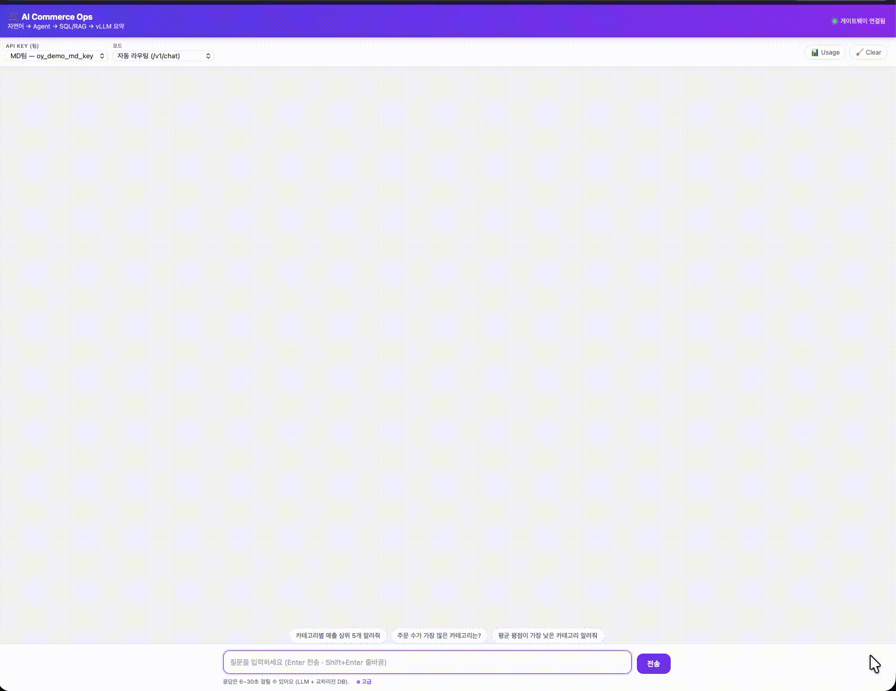
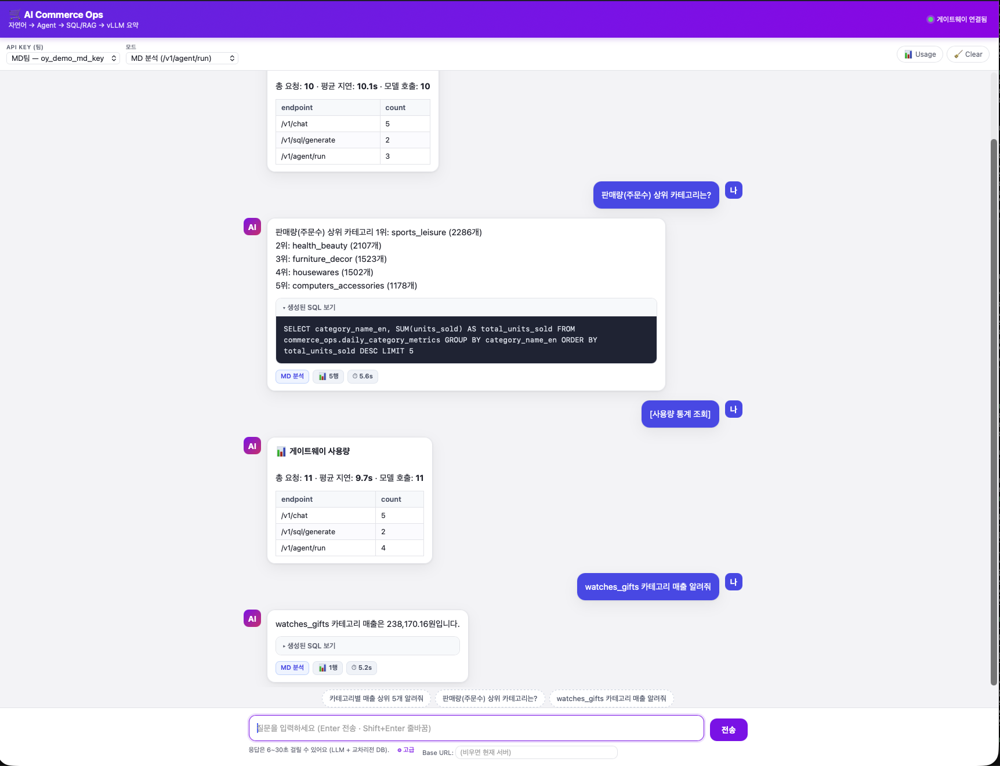

# 🛒 AI Commerce Operations Platform

> **Olist 커머스 데이터 기반 — 실시간 스트리밍 + RAG + LLM 멀티에이전트 운영 자동화 플랫폼**
> 자연어로 묻고, AI Agent가 **Text-to-SQL · RAG · 자체호스팅 LLM**으로 데이터에서 답을 만든다.

<p align="center">
  
  
  
  
  
  
  
</p>

<p align="center">
  
  <br/>
  <em>자연어 질의 → 자동 Agent 라우팅 → Text-to-SQL/RAG → 근거 기반 답변 (실시간 데모)</em>
</p>

---

## 한눈에

MD·CS·운영팀의 반복 데이터 업무(매출 분석, VOC, KPI 리포트)를
**자연어 → AI Agent → 데이터 → 인사이트** 흐름으로 자동화합니다.

단순 챗봇이 아니라, **실제 AWS 관리형 인프라 위에서 엔드투엔드로 동작·검증된** 운영 AI 플랫폼입니다.

- 🏪 **636개 지역 점포 시뮬레이터** — Olist 원본을 시간가속(TAF)으로 **AWS MSK에 실시간 발행**
- ⚡ **스트림 처리** — 리뷰 감성/VOC 분석 → RDS MySQL, 카테고리 KPI 실시간 집계
- 🔎 **다국어 RAG** — 리뷰 임베딩을 Qdrant에 적재, **한국어↔포르투갈어 의미검색**
- 🤖 **LangGraph 멀티에이전트** — MD / VOC / Insight 자동 라우팅 + **Text-to-SQL 가드레일**
- 🧠 **자체호스팅 LLM** — RunPod vLLM 위 **Qwen2.5-7B-Instruct** 추론
- 🚪 **2단 게이트웨이** — AWS API Gateway(인증·throttle) → FastAPI(에이전트 실행·사용량 로깅)
- 💬 **데모 웹 채팅 UI** — 에이전트 색상 배지·생성 SQL·결과 테이블을 실시간 표시

> 데이터셋: [Olist Brazilian E-Commerce](https://www.kaggle.com/datasets/olistbr/brazilian-ecommerce) (데모·PoC)

---

## ✨ 데모

자연어로 물으면 게이트웨이가 적절한 에이전트로 **자동 라우팅**하고,
**Text-to-SQL**로 쿼리를 생성·실행한 뒤, 생성된 SQL·결과·답변을 함께 보여줍니다.

<p align="center">
  
</p>

```text
질문:  "판매량이 가장 많은 카테고리는?"
   └─► route → MD 에이전트
       └─► Text-to-SQL:  SELECT category_name_en, SUM(units_sold) … GROUP BY … ORDER BY … LIMIT 10
           └─► health_beauty · sports_leisure · watches_gifts …  ← 근거 기반 한국어 답변
```

직접 띄워보기:

```bash
scripts/serve_demo.sh start     # 게이트웨이+웹UI 상시 기동 (http://localhost:8000)
scripts/serve_demo.sh status    # 상태 확인
```

---

## 🚀 핵심 기능

| 영역 | 내용 |
|------|------|
| **실시간 인제스천** | 636 지역 점포 → MSK Serverless(IAM). `key=seller_id` 순서보장, TAF 시간가속, 결정론적 재현 |
| **스트림 처리** | Review Analyzer(감성·VOC 분석, 멱등 UPSERT, DLQ) · Metric Aggregator(카테고리 KPI 실시간 집계) |
| **RAG** | fastembed 다국어 MiniLM-L12(384d) → Qdrant `reviews`. 언어 교차 의미검색 |
| **멀티에이전트** | LangGraph `route → retrieve(SQL+RAG) → synthesize(LLM)`. MD/VOC/Insight |
| **Text-to-SQL** | 스키마 한정 프롬프트 + `sql_guard` (별칭 혼용·환각 컬럼·금지 구문 차단) |
| **LLM** | RunPod vLLM(OpenAI 호환) Qwen2.5-7B-Instruct. Cloudflare 회피 UA 처리 |
| **게이트웨이** | FastAPI `/v1/*` + X-API-Key 인증 + 요청/실행/사용량 로깅. API Gateway가 앞단 위임 |
| **재현성** | `event_id = uuid5(타입, 자연키)`, `SIM_TODAY` 기준 시프트 → 몇 번을 돌려도 동일 결과 |

---

## 🏗️ 아키텍처 (엔드투엔드 검증됨)

```text
┌──────────────────────────────────────────────────────────────────────────┐
│  EC2 · 636개 지역 점포 시뮬레이터   (key=seller_id · TAF 시간가속 · 다중샤드)  │
└────────────────────────────────┬───────────────────────────────────────────┘
                                 ▼   AWS MSK Serverless (IAM · 서울)
   ┌── review_created ──┬──► Review Analyzer ─► RDS MySQL: review_analysis ─► review_analyzed
   │                    └──► Qdrant Loader   ─► Qdrant: reviews (임베딩 · RAG)          │
   │                                                                                   ▼
   └── order_events                                                            Metric Aggregator
                                              RDS MySQL: daily_category_metrics  + metric_updated

  [질의 경로]
   Client ─► AWS API Gateway (인증·throttle) ─► FastAPI Gateway ─► LangGraph
                                                  Router → MD │ VOC │ Insight
                                                    ├─ Text-to-SQL (+가드레일) ─► RDS MySQL
                                                    ├─ RAG ─► Qdrant 검색
                                                    └─ vLLM (Qwen2.5-7B) 추론
  [배치]  AWS MWAA cj-airflow ─► daily_commerce_ops_pipeline ─► daily_category_metrics   (P5)
```

| 단계 | 상태 |
|---|:---:|
| 실시간 인제스천 (edge → MSK) | ✅ |
| 스트림 처리 → RDS (Analyzer · Aggregator) | ✅ |
| RAG 적재 (→ Qdrant) | ✅ |
| LLM(vLLM Qwen2.5-7B) 연동 | ✅ |
| Gateway / Multi-Agent / RAG-Agent | ✅ (e2e 검증) |
| MWAA 일배치 DAG | 🟡 (환경 준비) |
| Usage Logger · k6 · 배포 | ⏳ |

---

## 🧱 기술 스택

| 레이어 | 사용 기술 |
|--------|-----------|
| **API/Agent** | FastAPI · LangGraph · Pydantic |
| **LLM** | RunPod **vLLM** · Qwen2.5-7B-Instruct (OpenAI 호환) |
| **RAG** | **Qdrant** v1.18 · fastembed (다국어 MiniLM-L12, 384d) |
| **스트리밍** | **AWS MSK Serverless** (IAM/OAUTHBEARER) · aiokafka |
| **데이터** | **AWS RDS MySQL 8.4** (olist_raw · commerce_ops 2스키마) |
| **배치** | **AWS MWAA** (Airflow 3.2) |
| **게이트웨이** | **AWS API Gateway (REST)** · Usage Plan(Rate Limit) — Terraform IaC |
| **인프라/운영** | EC2 · systemd · loguru · pytest |

> ⚠️ **실제 구현은 원안에서 재정렬**되었습니다 (PostgreSQL→RDS MySQL, Kafka→MSK, self-host Airflow→MWAA, OpenAI/Claude→vLLM, +Qdrant RAG). 단일 출처(SSOT): **[PROGRESS.md §9](./PROGRESS.md)**.

---

## ✅ 검증 결과 (실제 인프라)

| 항목 | 결과 |
|------|------|
| Olist → RDS MySQL 적재 | 8테이블 · order_items 112,650 · orders 99,441 · reviews 98,410 |
| state/city 엣지 노드 | **636** (DB·시뮬레이터 일치) |
| **1분 엔드투엔드** | 발행 **18,154건 (에러 0)** → 분석 18,154 (DLQ 0) → `daily_category_metrics` **8,712행** (606일 × 70카테고리) |
| GMV 상위 카테고리 | health_beauty · sports_leisure · watches_gifts … |
| RAG 적재/검색 | Qdrant `reviews` **6,000 벡터** · **KO↔PT 의미검색 정상** |
| Gateway e2e | `/v1/chat`→SUM(gmv)→health_beauty 324K · `/v1/agent/run` voc 20행+RAG · 인증 401/200 · latency 7~16s |
| 테스트 | **pytest 23 통과** |

---

## ⚡ 빠른 시작

> 🖥️ **AWS 없이 로컬 PC에서?** (macOS · Linux · WSL · Windows) — 한 커맨드로 전 구간 구동:
> bash `scripts/local/up.sh` · PowerShell `scripts\local\up.ps1` → 가이드 **[docs/LOCAL.md](./docs/LOCAL.md)**.
> 아래 절차는 **실 AWS 인프라(MSK·RDS·MWAA)** 전제다.

```bash
pip install -r requirements.txt
cp .env.example .env     # MSK/RDS/Qdrant/vLLM 값 채우기 (비밀은 .gitignore)

# 1) 데이터 계층 — RDS MySQL 스키마 + Olist 적재
python scripts/setup_mysql.py

# 2) MSK 토픽 생성
python scripts/kafka_admin.py --create

# 3) 시뮬레이터 (1분)
python scripts/prepare_edges.py
python scripts/run.py --duration 60

# 4) 컨슈머 (각 1분)
python scripts/review_analyzer.py  --duration 60
python scripts/metric_aggregator.py --duration 60
python scripts/qdrant_loader.py    --duration 60

# 5) RAG 재적재 + 게이트웨이/웹UI 기동
python scripts/reload_qdrant.py --limit 6000
scripts/serve_demo.sh start        # → http://localhost:8000

# 테스트
pytest tests
```

> 로그: `/workspace/app_logs/{app}/` · 상세 설계: [`docs/`](./docs/README.md) · 세션 기록: [`patch_logs/`](./patch_logs/)

---

## 🔌 API

| 메서드 · 경로 | 설명 |
|---|---|
| `POST /v1/chat` | 자동 Agent 라우팅 질의 (route→SQL+RAG→LLM) |
| `POST /v1/agent/run` | 지정 Agent 실행 (`md` / `voc` / `insight`) |
| `POST /v1/sql/generate` | Text-to-SQL (가드레일 통과 시 실행·반환) |
| `GET /v1/usage` | 요청수·평균 latency·엔드포인트별·모델 호출 통계 |
| `GET /v1/models` | 허용 LLM 목록 |
| `GET /health` · `GET /` | 헬스체크 · 데모 웹 채팅 UI |

인증: `X-API-Key` (sha256 → `commerce_ops.api_keys`). API Gateway 우회 직접호출은 `X-Origin-Secret`으로 차단. 전체 명세: **[docs/API.md](./docs/API.md)**.

---

## 🏪 실시간 점포 시뮬레이터 (Olist → AWS MSK)

**636개 지역 점포**(엣지노드 = `seller_state`+`seller_city`)가 각자 자기 데이터를 들고 **MSK로 실시간처럼 발행**합니다. 데이터를 점포별 샤드로 미리 쪼개두고(각 점포가 자기 데이터 보유 → 현실적 엣지 토폴로지 + 빠른 시작), 프로듀서가 원본 타임라인을 시간가속(TAF)으로 재생합니다. `key=seller_id`로 점포별 순서를 보장합니다.

| 스크립트 | 역할 |
|---|---|
| `scripts/prepare_edges.py` | Olist CSV → 점포별 샤드 `data/edges/*.jsonl` + `manifest.json` |
| `scripts/run.py` | 샤드 → MSK 발행 (시뮬레이터 **엔트리**) |
| `src/edge_simulator/` | 로직 모듈 (config·prepare·shards·producer·admin·verify·logging) |
| `scripts/kafka_admin.py` | 토픽 생성 / **리셋** / 목록 |
| `scripts/consume_check.py` | 도착 검증(소비) |

### 사전 준비
`.env` (예시):
```bash
KAFKA_BOOTSTRAP_SERVERS=boot-xxxx.kafka-serverless.ap-northeast-2.amazonaws.com:9098
KAFKA_SECURITY_PROTOCOL=SASL_SSL          # MSK IAM. 로컬 Kafka면 PLAINTEXT
AWS_REGION=ap-northeast-2
OLIST_DATA_DIR=/abs/path/to/olist/csv     # CSV 9종 위치
SIM_TODAY=2026-05-31                       # 재현 기준일(고정 권장)
```
```bash
pip install -r requirements.txt   # loguru·aiokafka·MSK IAM signer·pandas 등
```
> ⚠️ MSK Serverless는 **클러스터 VPC 안 + 보안그룹 9098 허용된 호스트**(예: 같은 VPC의 EC2)에서만 접속됩니다. 인증은 IAM(OAUTHBEARER) — 실행 호스트에 적절한 AWS 자격증명/역할 필요.

### 실행 (3단계)
```bash
# ① 데이터 분할 (최초 1회 / 리셋 시 재실행)  — 636 샤드 생성, ~15초
python scripts/prepare_edges.py
#    (옵션) --granularity seller   # 셀러 3,095개 단위

# ② 토픽 생성 후 발행
python scripts/kafka_admin.py --create
python scripts/run.py                              # 전체 발행(TAF 가속)
python scripts/run.py --dry-run --max-events 20000 # 브로커 없이 점검

# ③ 도착 확인
python scripts/consume_check.py --sample 3
#  → [consumed] {'order_events': N1, 'review_created': N2}
```

### 🔄 리셋 (언제든 처음부터)
```bash
python scripts/kafka_admin.py --reset      # 토픽 삭제→재생성 (오프셋 0부터 재처리)
# (선택) 분석 결과 DB도 초기화
mysql -h <host> -u <user> -p commerce_ops -e "TRUNCATE review_analysis; TRUNCATE daily_category_metrics;"
```

### ♻️ 재현 (항상 동일 결과)
시뮬레이터는 **결정론적**입니다 — `event_id = uuid5(event_type, 자연키)`, `occurred_at = SIM_TODAY 기준 시프트`.
같은 `--sim-today`와 같은 입력 데이터면 **매 실행 동일한 이벤트**가 발행되고, 컨슈머는 `event_id`/`review_id`로 멱등 UPSERT 하므로 몇 번을 재생해도 결과가 같습니다.
```bash
python scripts/kafka_admin.py --reset
python scripts/prepare_edges.py --sim-today 2026-05-31
python scripts/run.py
```

### 📈 대용량 트래픽 실험 (확장성 시연)
```bash
python scripts/run.py --scale 50 --rate 20000        # 점포 ×50, 초당 2만건
python scripts/run.py --shard-count 3 --shard-index 0 # 0/1/2를 머신·컨테이너별로
python scripts/run.py --rate 50000 --loop            # 지속 부하
```
> 컨슈머 병렬성 상한 = 파티션 수(현재 `order_events` 12p). 더 큰 부하는 파티션을 늘리세요. 실험 후 `--reset`으로 정리(과금 주의).
>
> 검증 결과(예): **5,438건 발행 → 5,459건 소비, 에러 0** (MSK Serverless `cj-cluster-edge`, ap-northeast-2).
> 구조: `src/edge_simulator/`(로직 모듈) + `scripts/`(CLI 엔트리). 로그 → `/workspace/app_logs/edge_simulator/`, 테스트 → `pytest tests/edge_simulator`.

---

## 📚 문서

전체 인덱스: **[docs/README.md](./docs/README.md)** · 진행 현황: **[PROGRESS.md](./PROGRESS.md)** · 남은 갭: **[TODO.md](./TODO.md)**

| 문서 | 내용 |
|------|------|
| [ARCHITECTURE](./docs/ARCHITECTURE.md) | 시스템 아키텍처 (동기/비동기 흐름) |
| [PRD](./docs/PRD.md) · [PROJECT](./docs/PROJECT.md) | 제품 요구사항 · 프로젝트 개요 |
| [ERD](./docs/ERD.md) · [DATA](./docs/DATA.md) | 데이터 모델 · Olist/시뮬레이션/Seed |
| [API](./docs/API.md) | REST API 명세 |
| [AGENTS](./docs/AGENTS.md) | Agent·라우팅·Text-to-SQL 가드레일·예시 질의 20건 |
| [KAFKA](./docs/KAFKA.md) · [AIRFLOW](./docs/AIRFLOW.md) | 이벤트 파이프라인 · 배치 DAG |
| [DEPLOYMENT](./docs/DEPLOYMENT.md) · [LOAD_TEST](./docs/LOAD_TEST.md) | 배포 · k6 부하 테스트 |
| [DEMO_SCRIPT](./docs/DEMO_SCRIPT.md) | 데모 시나리오 |
| [LOCAL](./docs/LOCAL.md) | 🖥️ 로컬 실행 (AWS 없이 · macOS/Linux/WSL · Ollama) |

---

## 🗺️ 로드맵

- ✅ **P3 Gateway** — FastAPI 인증/사용량 + `/v1/*`. Rate Limit·캐시는 **API Gateway Usage Plan** 위임 (`infra/terraform/api-gateway/`)
- ✅ **P4 Multi-Agent + RAG** — LangGraph Router→MD/VOC/Insight + Text-to-SQL(MySQL) + RAG(Qdrant) + vLLM (e2e 검증)
- 🟡 **P5 MWAA DAG** — `daily_commerce_ops_pipeline` S3 배포 (환경 준비됨)
- ⏳ **P6** — Usage Logger(토큰·비용) · k6 부하 테스트 · 배포 자동화 · 데모 영상

상세: [TODO.md](./TODO.md) (P1/P2/P3) · 완성도 매트릭스: [PROGRESS.md §8](./PROGRESS.md)

---

## 라이선스·데이터

Olist 데이터셋 이용 시 Kaggle 라이선스를 준수합니다. 상세는 [DATA.md](./docs/DATA.md).

---

<p align="center"><sub>최종 갱신: 2026-05-31 · 핵심 런타임(데이터→스트리밍→3에이전트→게이트웨이→RAG) 구현·e2e 검증 완료</sub></p>
