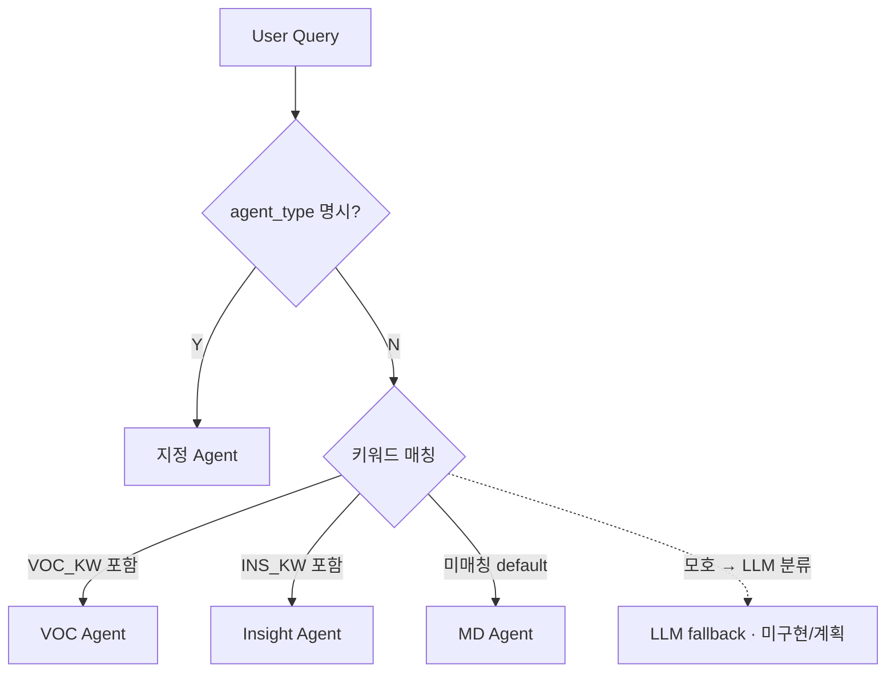
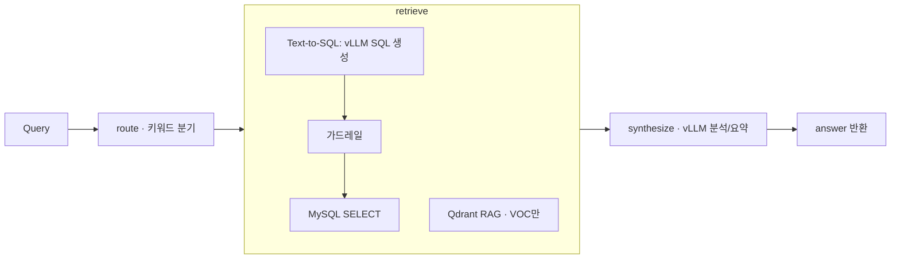

> **상태:** 구현 반영(REALIGNED) — 실제 스택: RDS MySQL · MSK(IAM) · MWAA · RunPod vLLM(Qwen2.5-7B) · Qdrant · AWS API Gateway. 본 문서의 PostgreSQL/Redis/Docker Compose/OpenAI·Claude 언급은 구현과 다름 — 스택 매핑·완성도는 [PROGRESS.md](../PROGRESS.md) 참조.

# Multi Agent 설계

| 항목 | 내용 |
|------|------|
| 문서 버전 | 2.0 |
| 작성일 | 2026-05-31 |
| 프레임워크 | LangGraph (`src/agents/graph.py`) |
| 관련 | [API.md](./API.md), [ERD.md](./ERD.md), [PROGRESS.md](../PROGRESS.md), [TODO.md](../TODO.md) |

---

## 1. Agent 개요

페르소나는 라우터가 분기하는 `agent_type`(`md`/`voc`/`insight`)으로 구현되며, 각각 전용 system prompt(`src/agents/prompts.py`의 `SYSTEM` dict)로 구분된다. 모든 데이터는 RDS MySQL 8.4의 `olist_raw`(원천) · `commerce_ops`(가공) 스키마에서 조회한다.

| Agent | 페르소나 | 핵심 능력 | 데이터 의존 |
|-------|----------|-----------|-------------|
| **MD Agent** (`md`) | MD | 매출·상품·카테고리·프로모션 | `olist_raw.order_items`, `commerce_ops.daily_category_metrics`, `olist_raw.products` |
| **VOC Agent** (`voc`) | CS | 리뷰·감성·VOC 분류 (+ Qdrant RAG) | `olist_raw.reviews`, `commerce_ops.review_analysis`, Qdrant `reviews` |
| **Insight Agent** (`insight`) | 운영 | KPI·원인·리포트 | `commerce_ops.daily_category_metrics`, 집계 다차원 |

---

## 2. Agent Router

### 2.1 라우팅 규칙

`POST /v1/chat`에서 `agent_type` 미지정 시 자동 라우팅. 구현은 **키워드 매칭 전용**이다(`src/agents/graph.py`의 `route`). 질의를 소문자화한 뒤 VOC 키워드 → Insight 키워드 순으로 검사하고, 어디에도 걸리지 않으면 **`md`가 기본값**이다. LLM 분류 fallback은 **미구현(계획)** — [TODO.md](../TODO.md) 참조.



| 우선순위 | 규칙 | 실제 키워드 (`graph.py`) |
|----------|------|------------------|
| 1 | 명시적 `agent_type`(`md`/`voc`/`insight`) → 그대로 사용 | — |
| 2 | `VOC_KW` 매칭 | 리뷰, voc, 불만, 배송, 품질, 감성, 부정, 후기, 평점, 고객 |
| 3 | `INS_KW` 매칭 | 원인, kpi, 이탈, 리포트, 요약, 전략, 전월, 추이, 액션, 분석해 |
| 4 | 미매칭 시 default | (그 외 전부) → `md` |
| 5 | ~~LLM fallback~~ | **미구현(계획)** — 모호 질의 단일 분류 호출 |

`POST /v1/agent/run`은 라우터를 건너뛰고 지정 Agent만 실행(`answer_query(agent_type=...)`).

> **TODO:** 라우팅 정확도 회귀 테스트(§6 예시 질의 20건)와 LLM fallback — [TODO.md](../TODO.md).

---

## 3. Agent 파이프라인 (공통)

실제 파이프라인은 LangGraph 3노드 선형 그래프다(`src/agents/graph.py`): **`route` → `retrieve` → `synthesize`**. `retrieve`는 Text-to-SQL과 (VOC일 때) RAG를 함께 수행하고, `synthesize`는 RunPod vLLM으로 한국어 답변을 생성한다. `prompt_versions` 로드 노드는 **미구현** — 프롬프트는 `src/agents/prompts.py`에 하드코딩되어 있다(§5).



- `retrieve`: `run_sql()`로 SQL 생성·가드·실행(실행 오류 시 1회 self-correction). 가드 거부/실행 실패는 `note`에 담아 답변 근거로 전달(예외로 파이프라인을 죽이지 않음). `agent_type=="voc"`이면 `search_reviews()`로 Qdrant 상위 5건 첨부.
- `synthesize`: SQL 결과(최대 20행) + RAG 스니펫 + `note`를 컨텍스트로 묶어 agent별 system prompt와 함께 vLLM `chat(max_tokens=600)` 호출.

> **미구현:** prompt 버저닝 로드, `agent_executions`/`model_usage_logs` 실행 로깅 — [PROGRESS.md](../PROGRESS.md) · [TODO.md](../TODO.md).

---

## 4. Text-to-SQL 가드레일

구현: `src/agents/sql_guard.py`(`guard()`), 생성·실행은 `src/agents/text_to_sql.py`(`run_sql()`). 파서는 **`sqlglot`(MySQL 방언, `read="mysql"`)** 이다 — `sqlparse`가 아니다.

### 4.1 허용 테이블 (화이트리스트)

`guard()`의 `WHITELIST` 상수에 하드코딩된 **10개 테이블**(스키마 접두 필수):

**`olist_raw`** (8개)

- `customers`, `orders`, `order_items`, `products`, `reviews`, `payments`, `sellers`, `category_translation`

**`commerce_ops`** (2개)

- `daily_category_metrics`, `review_analysis`

> **미구현:** 시뮬레이터 조인용 뷰 `v_orders_sim` / `v_reviews_sim`은 DDL에 정의되지 않았고 화이트리스트에도 없다(계획).

### 4.2 금지 키워드 (MySQL 특화, 대소문자 무시·단어 경계 `\b`)

`_BLACKLIST` 정규식:

```text
INSERT, UPDATE, DELETE, DROP, TRUNCATE, ALTER, CREATE, GRANT, REVOKE,
REPLACE, MERGE, CALL,
information_schema, performance_schema, mysql, sys,
sleep, benchmark, load_file, outfile
```

### 4.3 쿼리 제약

| 규칙 | 값 |
|------|-----|
| 문장 유형 | `SELECT` only (`exp.Select` 타입 검사) |
| 최대 행 | `LIMIT` 없으면 `max_rows` 자동 append (`run_sql` 호출 시 50, `guard` 기본 100) |
| 타임아웃 | DB `MAX_EXECUTION_TIME` 미설정 — **미구현(계획)** |
| 스키마 접두 | 반드시 `olist_raw.` 또는 `commerce_ops.` (접두 없으면 화이트리스트 미스 → 거부) |

### 4.4 검증 순서 (`guard()`)

1. 트림 후 trailing `;` 제거, 빈 SQL 거부
2. `_BLACKLIST` 정규식 스캔(금지 키워드)
3. `sqlglot.parse_one(sql, read="mysql")` 파싱 → 실패 시 거부
4. 루트 노드가 `exp.Select`인지 확인(SELECT 외 거부)
5. `find_all(exp.Table)`로 모든 테이블의 `db.name`을 추출해 화이트리스트 대조
6. `LIMIT` 부재 시 자동 append, `parsed.sql(dialect="mysql")`로 재출력

거부 시 `SQLRejected` 예외. 파이프라인(`retrieve`)은 이를 잡아 `note="SQL 사용 불가: ..."`로 강등하여 답변 근거에 포함한다(향후 `agent_executions.status=sql_rejected` 로깅은 미구현).

> **참고:** `run_sql()`은 생성 SQL 실행 시 DB 오류가 나면 오류 메시지를 힌트로 1회 재생성(self-correction)한다. 단, 가드 정책 위반은 즉시 `SQLRejected`로 중단(재시도 없음).

---

## 5. 프롬프트 템플릿 구조

**현재 모든 프롬프트는 `src/agents/prompts.py`에 하드코딩**되어 있다. `prompt_versions` 테이블은 스키마에 존재하나 코드에서 **로드하지 않는다(미사용)** — DB 기반 버저닝은 **미구현(계획)**([TODO.md](../TODO.md)).

| 코드 상수 (`prompts.py`) | 용도 |
|------|------|
| `SYSTEM["md"|"voc"|"insight"]` | agent별 역할·톤·출력 지침(한국어) |
| `TEXT2SQL_SYS` | Text-to-SQL 시스템 프롬프트(규칙·few-shot 예시 포함) |
| `SCHEMA_SNIPPET` | 화이트리스트 테이블 스키마 스니펫(MySQL, 접두 필수) |

### 5.2 MD Agent `SYSTEM["md"]` (실제)

```text
너는 Olist 브라질 커머스의 MD(머천다이징) 분석 에이전트다. 한국어로 간결히, 숫자 중심으로 답한다.
제공된 SQL 결과만 근거로 하고 수치를 지어내지 않는다. 카테고리·매출·재구매·프로모션 관점.
```

### 5.3 VOC Agent `SYSTEM["voc"]`

```text
너는 CS/VOC 에이전트다. 제공된 집계와 검색된 리뷰 스니펫을 근거로 감성·VOC 테마
(품질/배송/가격/서비스)를 요약한다. 한국어로, 대표 리뷰를 인용.
```

### 5.4 Insight Agent `SYSTEM["insight"]`

```text
너는 운영 분석가다. 제공된 지표로 '요약 → 원인 → 권장 액션' 구조의 한국어 리포트를 만든다.
근거 없는 추정은 피한다.
```

### 5.5 Text-to-SQL 전용 (`TEXT2SQL_SYS`, 요약)

```text
너는 커머스 분석용 Text-to-SQL 엔진이다. 질문에 답하는 MySQL SELECT 한 문장만 생성한다.
- SELECT만(DDL/DML 금지). 테이블은 스키마 접두 필수(olist_raw./commerce_ops.).
- 별칭 사용 시 일관 참조(별칭과 완전수식 혼용 금지).
- commerce_ops.daily_category_metrics는 카테고리×일자 사전집계 테이블(매출=SUM(gmv)). JOIN 금지.
- 리뷰 본문은 commerce_ops.review_analysis ⋈ olist_raw.reviews ON review_id.
- 기간 조건 없으면 전체 집계, '최근 N일/이번 달'만 SIM_TODAY 기준 DATE_SUB 필터.
JSON만 출력: {"sql":"..."}
```

> SQL 생성은 OpenAI 호환 `chat_json()`으로 호출되어 `{"sql": "..."}` JSON에서 SQL을 추출한다(`text_to_sql.py`). 출력 형식은 위 프롬프트의 few-shot 예시로 강제된다.

> **미구현:** `prompt_versions` 시드/로드 및 API `metadata.prompt_version` 노출 — [TODO.md](../TODO.md).

---

## 6. 예시 질의 (데모·회귀 20건)

| # | Agent | 질의 (ko) | 기대 응답 형태 |
|---|-------|-----------|----------------|
| 1 | MD | 이번 달 판매량이 감소한 상품 알려줘 | `tables.declining_products`, 인사이트 bullet |
| 2 | MD | 카테고리별 매출 순위 알려줘 | ranked table Top N |
| 3 | MD | 재구매율 높은 상품 알려줘 | product list + metric |
| 4 | MD | 프로모션 대상 상품 추천해줘 | 추천 리스트 + 이유 |
| 5 | MD | 지난 7일 GMV Top 10 카테고리 | `daily_category_metrics` 기반 |
| 6 | MD | health_beauty 카테고리 월간 매출 추이 | 시계열 rows |
| 7 | MD | 주문 건수가 많은 판매자 Top 5 | seller_id table |
| 8 | VOC | 최근 부정 리뷰가 증가한 상품 알려줘 | product + delta negative |
| 9 | VOC | 최근 품질 관련 불만 알려줘 | `voc_category=quality` 샘플 |
| 10 | VOC | 배송 관련 VOC 알려줘 | delivery 테마 요약 |
| 11 | VOC | 리뷰 점수 1점인 주문 최근 10건 | review list |
| 12 | VOC | 긍정 리뷰 비율이 낮은 카테고리 | category ranking |
| 13 | VOC | 리뷰 메시지에서 '늦다' 키워드 포함 건 | Qdrant RAG 의미 검색(`search_reviews`) |
| 14 | Insight | 매출 감소 원인 분석해줘 | findings + root_causes |
| 15 | Insight | 고객 이탈 분석해줘 | 코호트/재구매 서술 |
| 16 | Insight | 전월 대비 KPI 요약해줘 | executive summary |
| 17 | Insight | VOC가 매출에 미친 영향 요약 | cross-metric narrative |
| 18 | MD | 결제 수단별 매출 비중 | payments 집계 |
| 19 | VOC | review_score 4 이하 최근 트렌드 | trend table |
| 20 | Insight | 다음 주 액션 아이템 3가지 제안 | `recommended_actions` |

회귀 실행 (**미구현**): `pytest tests/agents/test_regression_queries.py` — 스키마·필드 존재만 검증(LLM 비결정성 고려) — [TODO.md](../TODO.md).

---

## 7. LLM 모델 선택

모든 역할은 **단일 백엔드 — RunPod vLLM(OpenAI 호환)에서 서빙되는 `Qwen/Qwen2.5-7B-Instruct`** 로 처리된다(`src/common/llm.py`의 `chat()`/`chat_json()`). OpenAI/Claude는 사용하지 않는다.

| 용도 | 실제 모델 | 비고 |
|------|-----------|------|
| 라우팅 | (LLM 미사용 — 키워드 매칭) | LLM fallback은 미구현 |
| MD SQL + 분석 | `Qwen/Qwen2.5-7B-Instruct` (vLLM) | `chat_json`(SQL) + `chat`(분석) |
| VOC 감성·분류 | `Qwen/Qwen2.5-7B-Instruct` (vLLM) | RAG 스니펫 + `chat` 요약 |
| Insight 리포트 | `Qwen/Qwen2.5-7B-Instruct` (vLLM) | `chat` 서술 |
| SQL only API | `Qwen/Qwen2.5-7B-Instruct` (vLLM) | `chat_json` |

환경 변수(`.env`):

```text
VLLM_URL=https://<pod>.proxy.runpod.net   # /v1 자동 보정
VLLM_API_KEY=
VLLM_MODEL=Qwen/Qwen2.5-7B-Instruct        # 기본값과 동일
```

> RunPod 프록시는 Cloudflare 뒤에 있어 모든 호출에 브라우저 User-Agent를 강제한다(error 1010 회피, `llm.py`).
>
> 비용 추정(`model_usage_logs.estimated_cost_usd`): **미구현** — [TODO.md](../TODO.md).

---

## 8. LangGraph 노드 (실제)

`build_graph()` (`src/agents/graph.py`) — `START → route → retrieve → synthesize → END` 선형 그래프.

| 노드 | 역할 | 함수 |
|------|------|-------|
| `route` | 키워드 기반 `agent_type` 결정(명시 시 그대로) | `route()` |
| `retrieve` | Text-to-SQL(생성→가드→실행) + (VOC) Qdrant RAG | `retrieve()` |
| `synthesize` | SQL 결과·RAG·note → vLLM 한국어 답변 생성 | `synthesize()` |

> 이전 초안의 `gen_sql`/`run_sql`/`analyze_*`/`format_response` 분기 노드는 `retrieve`/`synthesize` 두 노드로 통합되었다(agent별 분기는 노드가 아닌 system prompt 선택으로 처리).

---

## 9. 변경 이력

| 버전 | 날짜 | 변경 |
|------|------|------|
| 2.0 | 2026-05-31 | REALIGNED — 실제 구현 반영 |
| 1.0 | 2026-05-31 | Agent 설계 초안 |
