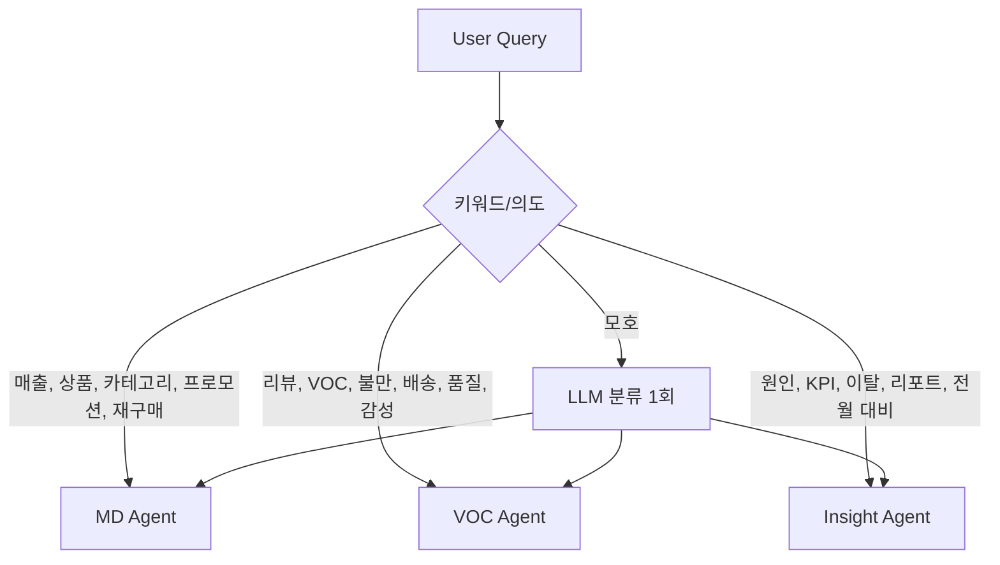
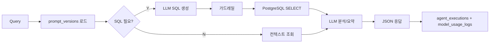

> **상태:** Draft (Pre-implementation)

# Multi Agent 설계

| 항목 | 내용 |
|------|------|
| 문서 버전 | 1.0 |
| 작성일 | 2026-05-31 |
| 프레임워크 | LangGraph (예정) |
| 관련 | [API.md](./API.md), [ERD.md](./ERD.md) |

---

## 1. Agent 개요

| Agent | 페르소나 | 핵심 능력 | 데이터 의존 |
|-------|----------|-----------|-------------|
| **MD Agent** | MD | 매출·상품·카테고리·프로모션 | `order_items`, `daily_category_metrics`, `products` |
| **VOC Agent** | CS | 리뷰·감성·VOC 분류 | `reviews`, `review_analysis` |
| **Insight Agent** | 운영 | KPI·원인·리포트 | `daily_category_metrics`, 집계 다차원 |

---

## 2. Agent Router

### 2.1 라우팅 규칙

`POST /v1/chat`에서 `agent_type` 미지정 시 자동 라우팅.



| 우선순위 | 규칙 | 예시 키워드 (ko) |
|----------|------|------------------|
| 1 | 명시적 `agent_type` in `/v1/agent/run` | — |
| 2 | VOC 키워드 매칭 | 리뷰, VOC, 불만, 배송, 품질, 부정 |
| 3 | Insight 키워드 | 원인, KPI, 이탈, 리포트, 요약, 전략 |
| 4 | MD 키워드 (default) | 매출, 판매, 상품, 카테고리, 프로모션 |
| 5 | LLM fallback | 단일 토큰 분류 JSON |

`POST /v1/agent/run`은 라우터를 건너뛰고 지정 Agent만 실행.

> **TODO (구현):** 라우팅 정확도 회귀 테스트 — §6 예시 질의 20건.

---

## 3. Agent 파이프라인 (공통)



---

## 4. Text-to-SQL 가드레일

### 4.1 허용 테이블 (화이트리스트)

**`olist_raw`**

- `customers`, `orders`, `order_items`, `products`, `reviews`, `payments`, `sellers`, `category_translation`

**`commerce_ops`**

- `daily_category_metrics`, `review_analysis`
- 조인용 뷰 `v_orders_sim`, `v_reviews_sim` (**TODO:** DDL에서 정의)

### 4.2 금지 키워드 (대소문자 무시, 단어 경계)

```text
INSERT, UPDATE, DELETE, DROP, TRUNCATE, ALTER, CREATE, GRANT, REVOKE,
COPY, EXECUTE, CALL, pg_sleep, information_schema, pg_catalog
```

### 4.3 쿼리 제약

| 규칙 | 값 |
|------|-----|
| 문장 유형 | `SELECT` only (WITH CTE 허용) |
| 최대 행 | `options.max_rows` 또는 100 |
| 타임아웃 | 5초 (**TODO:** DB `statement_timeout`) |
| 스키마 접두 | 반드시 `olist_raw.` 또는 `commerce_ops.` |

### 4.4 검증 순서

1. 키워드 블랙리스트 스캔
2. SQL 파서로 statement type 확인 (sqlparse 등)
3. 테이블명 화이트리스트 추출·검증
4. `LIMIT` 없으면 자동 append

거부 시 `SQL_REJECTED` + `agent_executions.status=sql_rejected`.

---

## 5. 프롬프트 템플릿 구조

### 5.1 `prompt_versions` 레코드

| 필드 | 용도 |
|------|------|
| `system_prompt` | 역할·톤·출력 JSON 스키마 |
| `user_template` | `{query}`, `{schema_snippet}`, `{sim_today}`, `{sample_rows}` |
| `version_tag` | `md-v1.0.0` — API `metadata.prompt_version`에 노출 |

### 5.2 MD Agent `system_prompt` (요약 초안)

```text
You are an MD analytics agent for Brazilian e-commerce (Olist).
- Answer in Korean unless asked otherwise.
- Use only provided SQL results; do not invent numbers.
- Output JSON: { "answer", "insights": [], "tables": [] }
- Reference dates relative to SIM_TODAY={sim_today}.
```

### 5.3 VOC Agent

```text
You are a CS/VOC agent. Classify themes: quality, delivery, price, service.
Use review_analysis.sentiment and voc_category when available.
```

### 5.4 Insight Agent

```text
You are an operations analyst. Produce executive summary with
"findings", "root_causes", "recommended_actions" arrays.
Prefer daily_category_metrics for trends.
```

### 5.5 Text-to-SQL 전용 템플릿

```text
Given schema:
{schema_snippet}
Generate PostgreSQL SELECT only for: {query}
Use SIM_TODAY = '{sim_today}' for relative dates.
Return SQL only, no markdown.
```

> **TODO (구현):** `prompt_versions` 시드 SQL에 전문 저장.

---

## 6. 예시 질의 (데모·회귀 20건)

| # | Agent | 질의 (ko) | 기대 응답 형태 |
|---|-------|-----------|----------------|
| 1 | MD | 이번 달 판매량이 감소한 상품 알려줘 | `tables.declining_products`, 인사이트 bullet |
| 2 | MD | 카테고리별 매출 순위 알려줘 | ranked table Top N |
| 3 | MD | 재구매율 높은 상품 알려줘 | product list + metric |
| 4 | MD | 프로모션 대상 상품 추천해줘 | 추천 리스트 + 이유 |
| 5 | MD | 지난 7일 GMV Top 10 카테고리 | `daily_category_metrics` 기반 |
| 6 | MD | health_beauty 카테고리 월간 매출 추이 | 시계열 rows |
| 7 | MD | 주문 건수가 많은 판매자 Top 5 | seller_id table |
| 8 | VOC | 최근 부정 리뷰가 증가한 상품 알려줘 | product + delta negative |
| 9 | VOC | 최근 품질 관련 불만 알려줘 | `voc_category=quality` 샘플 |
| 10 | VOC | 배송 관련 VOC 알려줘 | delivery 테마 요약 |
| 11 | VOC | 리뷰 점수 1점인 주문 최근 10건 | review list |
| 12 | VOC | 긍정 리뷰 비율이 낮은 카테고리 | category ranking |
| 13 | VOC | 리뷰 메시지에서 '늦다' 키워드 포함 건 | text search (**TODO:** ILIKE vs embedding) |
| 14 | Insight | 매출 감소 원인 분석해줘 | findings + root_causes |
| 15 | Insight | 고객 이탈 분석해줘 | 코호트/재구매 서술 |
| 16 | Insight | 전월 대비 KPI 요약해줘 | executive summary |
| 17 | Insight | VOC가 매출에 미친 영향 요약 | cross-metric narrative |
| 18 | MD | 결제 수단별 매출 비중 | payments 집계 |
| 19 | VOC | review_score 4 이하 최근 트렌드 | trend table |
| 20 | Insight | 다음 주 액션 아이템 3가지 제안 | `recommended_actions` |

회귀 실행 (**TODO**): `pytest tests/agents/test_regression_queries.py` — 스키마·필드 존재만 검증 (LLM 비결정성 고려).

---

## 7. LLM 모델 선택

| 용도 | 권장 모델 | 이유 |
|------|-----------|------|
| 라우팅 fallback | `gpt-4o-mini` | 저비용·저지연 |
| MD SQL + 분석 | `gpt-4o-mini` | 구조화 출력 충분 |
| VOC 감성·분류 | `claude-3-5-sonnet-20241022` | 긴 리뷰 텍스트 |
| Insight 리포트 | `claude-3-5-sonnet-20241022` | 서술 품질 |
| SQL only API | `gpt-4o-mini` | 단일 목적 |

환경 변수:

```text
OPENAI_API_KEY=
ANTHROPIC_API_KEY=
DEFAULT_CHAT_MODEL=gpt-4o-mini
DEFAULT_INSIGHT_MODEL=claude-3-5-sonnet-20241022
```

비용 추정: `model_usage_logs.estimated_cost_usd` — **TODO:** provider별 단가 테이블 코드화.

---

## 8. LangGraph 노드 (예정)

| 노드 | Agent |
|------|-------|
| `route` | Router |
| `gen_sql` | 공통 |
| `run_sql` | 공통 |
| `analyze_md` / `analyze_voc` / `analyze_insight` | 분기 |
| `format_response` | 공통 |

---

## 9. 변경 이력

| 버전 | 날짜 | 변경 |
|------|------|------|
| 1.0 | 2026-05-31 | Agent 설계 초안 |
