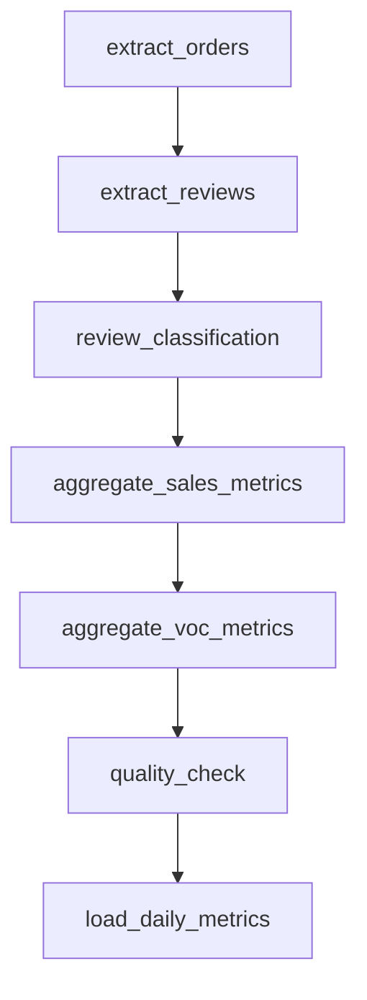

> **상태:** 구현 반영(REALIGNED) — 실제 스택: RDS MySQL · MSK(IAM) · MWAA · RunPod vLLM(Qwen2.5-7B) · Qdrant · AWS API Gateway. 본 문서의 PostgreSQL/Redis/Docker Compose/OpenAI·Claude 언급은 구현과 다름 — 스택 매핑·완성도는 [PROGRESS.md](../PROGRESS.md) 참조.

# Airflow 배치 파이프라인

| 항목 | 내용 |
|------|------|
| 문서 버전 | 1.0 |
| DAG ID | `daily_commerce_ops_pipeline` |
| 작성일 | 2026-05-31 |

---

## 1. DAG 개요

**목적:** 일별 KPI·VOC 통계·Agent용 사전 집계(`daily_category_metrics`) 생성.



---

## 2. 스케줄·실행 정책

| 항목 | 값 |
|------|-----|
| `schedule_interval` | `0 2 * * *` (매일 02:00 UTC) |
| `start_date` | `2026-01-01` |
| `catchup` | `False` (v1 — 백필 수동만) |
| `max_active_runs` | 1 |
| `default_args.retries` | 2 |
| `default_args.retry_delay` | 5분 |
| `execution_timeout` | 태스크별 30~60분 |

### 2.1 Backfill (수동)

```bash
# TODO: 구현 후
airflow dags backfill daily_commerce_ops_pipeline \
  -s 2026-05-01 -e 2026-05-30
```

`SIM_TODAY`와 무관하게 **논리 일자 `{{ ds }}`** 기준으로 집계. 시뮬 컬럼은 `shift_days` 매핑 테이블 참조 ([DATA.md](./DATA.md)).

---

## 3. 태스크 상세

### 3.1 `extract_orders`

| 항목 | 내용 |
|------|------|
| 유형 | PythonOperator / SQL |
| 입력 | `olist_raw.orders`, `order_items`, `payments` |
| 출력 | 스테이징 `stg_orders_daily` (commerce_ops, **TODO** DDL) |
| 로직 | `{{ ds }}`에 해당하는 `sim_order_date` 주문 추출 |

```sql
-- 의사 SQL
INSERT INTO stg_orders_daily (metric_date, order_id, customer_id, gmv, ...)
SELECT :ds, o.order_id, ...
FROM olist_raw.orders o
JOIN olist_raw.order_items oi ON ...
WHERE sim_order_date = :ds;
```

---

### 3.2 `extract_reviews`

| 입력 | `olist_raw.reviews` |
| 출력 | `stg_reviews_daily` |
| 로직 | `sim_review_date = {{ ds }}` 리뷰 |

---

### 3.3 `review_classification`

| 입력 | `stg_reviews_daily` |
| 출력 | `review_analysis` 보강 (배치) |
| 로직 | LLM 또는 규칙 기반 분류 — Kafka 미경유 건 처리 |

| 방식 | v1 권장 |
|------|---------|
| A | 기존 `review_analysis` 있으면 skip |
| B | 없으면 규칙: `review_score <= 2` → negative |

> **TODO:** LLM 배치 비용 vs 규칙 — 구현 시 선택 기록.

---

### 3.4 `aggregate_sales_metrics`

| 입력 | `stg_orders_daily`, `products`, `category_translation` |
| 출력 | `stg_sales_metrics_daily` |
| 지표 | `gmv`, `order_count`, `units_sold` by category |

---

### 3.5 `aggregate_voc_metrics`

| 입력 | `stg_reviews_daily`, `review_analysis` |
| 출력 | `stg_voc_metrics_daily` |
| 지표 | `avg_review_score`, `negative_review_count`, `voc_quality_count`, `voc_delivery_count` |

---

### 3.6 `quality_check`

| 입력 | `stg_sales_metrics_daily`, `stg_voc_metrics_daily` |
| 출력 | pass/fail (XCom) |
| 실패 시 | downstream skip, 알림 **TODO** |

#### quality_check 규칙

| ID | 규칙 | 임계 |
|----|------|------|
| Q1 | `gmv >= 0` 모든 카테고리 | hard fail |
| Q2 | `order_count > 0` 전체 합 | hard fail (휴일 예외 **TODO**) |
| Q3 | 전일 대비 `gmv` 변동 | abs(delta) < 80% (이상치) |
| Q4 | `negative_review_count <= order_count` | hard fail |
| Q5 | row count vs 7일 이동평균 | ±50% warn, ±90% fail |
| Q6 | NULL 비율 | any required column NULL → fail |

```python
# 의사 코드
def quality_check(ds, **ctx):
    sales = fetch_stg_sales(ds)
    assert (sales["gmv"] >= 0).all()
    ...
    return {"status": "passed"}
```

---

### 3.7 `load_daily_metrics`

| 입력 | `stg_sales_metrics_daily` JOIN `stg_voc_metrics_daily` |
| 출력 | `commerce_ops.daily_category_metrics` |
| 로직 | UPSERT on `(metric_date, category_name_en)` |

```sql
INSERT INTO daily_category_metrics (
  metric_date, category_name_en, gmv, order_count, units_sold,
  avg_review_score, negative_review_count,
  voc_quality_count, voc_delivery_count, loaded_at
)
SELECT ...
ON CONFLICT (metric_date, category_name_en) DO UPDATE SET ...;
```

완료 후 선택: Kafka `metric_updated` 발행 (**TODO**).

---

## 4. 태스크 I/O 요약表

| Task | Reads | Writes |
|------|-------|--------|
| extract_orders | olist_raw.* | stg_orders_daily |
| extract_reviews | olist_raw.reviews | stg_reviews_daily |
| review_classification | stg_reviews_daily | review_analysis |
| aggregate_sales_metrics | stg_orders_daily + dim | stg_sales_metrics_daily |
| aggregate_voc_metrics | stg_reviews_daily + review_analysis | stg_voc_metrics_daily |
| quality_check | stg_* | XCom only |
| load_daily_metrics | stg_* | daily_category_metrics |

---

## 5. Airflow 프로젝트 구조 (예정)

```text
airflow/
├── dags/
│   └── daily_commerce_ops_pipeline.py
├── plugins/
└── include/sql/
    ├── extract_orders.sql
    └── load_daily_metrics.sql
```

Connections (**TODO** 구현):

| Conn ID | Type |
|---------|------|
| `postgres_olist` | Postgres → olist_raw |
| `postgres_ops` | Postgres → commerce_ops |

---

## 6. DAG 의존성·실패 처리

```text
extract_orders ──┐
                 ├──> (parallel 가능하나 v1은 sequential)
extract_reviews ─┘
        ↓
review_classification
        ↓
aggregate_sales_metrics
        ↓
aggregate_voc_metrics
        ↓
quality_check  --(fail)--> skip load, mark dag run failed
        ↓
load_daily_metrics
```

---

## 7. Agent 연계

| Agent | 사용 테이블 | 갱신 주기 |
|-------|-------------|-----------|
| MD | `daily_category_metrics` | 일 1회 + Kafka near-real-time (**부분**) |
| Insight | 동일 | 일 1회 |
| VOC | `review_analysis` | Kafka 실시간 + 배치 보강 |

> **TODO (구현 후):** DAG 성공 후 Agent 샘플 질의 E2E 검증.

---

## 8. 변경 이력

| 버전 | 날짜 | 변경 |
|------|------|------|
| 1.0 | 2026-05-31 | Airflow 설계 초안 |
