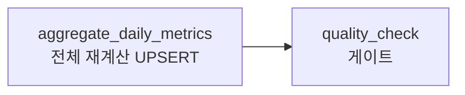
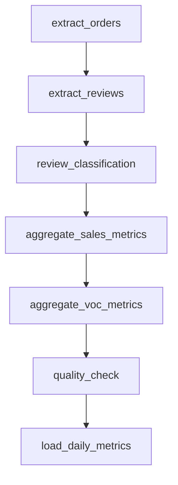

> **상태:** 구현 반영(REALIGNED) — 실제 스택: RDS MySQL · MSK(IAM) · MWAA · RunPod vLLM(Qwen2.5-7B) · Qdrant · AWS API Gateway. 본 문서의 PostgreSQL/Redis/Docker Compose/OpenAI·Claude 언급은 구현과 다름 — 스택 매핑·완성도는 [PROGRESS.md](../PROGRESS.md) 참조.

# Airflow 배치 파이프라인

| 항목 | 내용 |
|------|------|
| 문서 버전 | 2.0 |
| DAG ID | `daily_commerce_ops_pipeline` |
| 작성일 | 2026-05-31 |
| 실행 환경 | **AWS MWAA** (`cj-airflow`, Airflow 3.2.1, mw1.small, 서울) |
| 소스 코드 | [`dags/daily_commerce_ops_pipeline.py`](../dags/daily_commerce_ops_pipeline.py) |
| DB | **RDS MySQL** — 스키마 `olist_raw`(원천) + `commerce_ops`(집계) |

> ⚠️ **이 문서의 §3~§6은 REALIGNED 되었다.** 초기 설계(self-host Airflow + PostgreSQL + staging 테이블 7-task)는 **구현되지 않았다**. 실제로 배포 대상인 DAG는 **2-task**다. 본문은 **실제 구현(2-task)** 을 기준으로 서술하고, **원안(7-task)** 은 §7에 "계획"으로 보존한다. 남은 작업은 [../TODO.md](../TODO.md), 완성도는 [../PROGRESS.md](../PROGRESS.md) 참조.

---

## 1. DAG 개요 (실제 구현)

**목적:** Agent용 사전 집계 테이블 `commerce_ops.daily_category_metrics`를 **(날짜×카테고리)** 단위로 생성·유지.

**역할 — 람다 아키텍처의 배치 arm(확정값).** 스트리밍 Metric Aggregator(`src/consumers/metric_aggregator.py`)가 이벤트 도착 시 **영향 날짜만 근사 갱신**하는 반면, 이 DAG는 **날짜 필터 없이 전체를 재계산**하여 스트림의 누락·유실·드리프트를 보정한다. 스트림과 배치는 **같은 카테고리/지표 정의**를 쓰고 **같은 키로 UPSERT**하므로 동일한 행으로 수렴한다.

실제 태스크는 단 2개다.



| # | Task | 하는 일 |
|---|------|---------|
| 1 | `aggregate_daily_metrics` | **단일 full-recompute UPSERT SQL** 실행 → `commerce_ops.daily_category_metrics` 멱등 적재 |
| 2 | `quality_check` | 적재 결과에 대한 행 수·날짜 수·음수 지표 게이트 |

> **staging 테이블 없음.** `stg_orders_daily` · `stg_reviews_daily` · `stg_sales_metrics_daily` · `stg_voc_metrics_daily` 등은 **만들지 않는다.** 추출/분류/판매집계/VOC집계를 분리한 7개 태스크도 **없다.** 모든 집계는 태스크 1의 단일 SQL이 JOIN+GROUP BY로 한 번에 수행한다. (원안은 §7.)

---

## 2. 스케줄·실행 정책 (실제 구현)

`@dag(...)` 데코레이터에 정의된 실제 값이다.

| 항목 | 값 | 비고 |
|------|-----|------|
| `schedule` | `@daily` | 매일 1회 |
| `start_date` | `2026-05-01` (UTC, `pendulum.datetime`) | |
| `catchup` | `False` | 과거 미실행분 자동 백필 안 함 |
| `tags` | `["commerce", "batch", "metrics"]` | |
| `doc_md` | 모듈 docstring | MWAA UI에 렌더 |

> 원안의 `0 2 * * *` / `start_date 2026-01-01` / `max_active_runs` / `retries` / `retry_delay` / `execution_timeout`는 **현재 코드에 없다.** 재시도·타임아웃은 추후 운영 강화 시 추가 (계획, [../TODO.md](../TODO.md)).

### 2.1 멱등성·재계산

- **전체 재계산:** 태스크 1의 SQL에는 `{{ ds }}`·날짜 파라미터가 **없다.** `review_analysis`의 모든 `sim_review_date`를 매 실행 재집계한다.
- **멱등 키:** UPSERT `ON DUPLICATE KEY UPDATE` on `(metric_date, category_name_en)`. 재실행·중복 트리거가 안전하며 스트림 업데이트와 같은 행으로 수렴한다.
- **백필 불필요:** 전체 재계산이므로 별도 backfill 명령이 필요 없다(매 실행이 곧 전체 보정).

---

## 3. 태스크 상세 (실제 구현)

### 3.1 `aggregate_daily_metrics`

| 항목 | 내용 |
|------|------|
| 유형 | TaskFlow `@task` (PythonOperator), 내부에서 `pymysql` 직접 사용 |
| 입력 | `commerce_ops.review_analysis` ⋈ `olist_raw.order_items` ⋈ `olist_raw.products` ⋈ `olist_raw.category_translation` |
| 출력 | `commerce_ops.daily_category_metrics` (UPSERT) |
| 반환 | `{"affected": <영향 행 수>}` (XCom) |
| 트랜잭션 | `autocommit=False` → 단일 `execute` 후 `commit`, `finally`에서 `close` |

**집계 기준**

- `metric_date = review_analysis.sim_review_date` (리뷰된 주문 기준)
- 카테고리 = `COALESCE(ct.product_category_name_english, p.product_category_name, 'unknown')`
- 그룹핑 = `sim_review_date × category`
- `WHERE ra.sim_review_date IS NOT NULL`

**산출 지표** (스트리밍 Aggregator와 동일 정의)

| 컬럼 | 정의 |
|------|------|
| `gmv` | `ROUND(SUM(oi.price), 2)` |
| `order_count` | `COUNT(DISTINCT ra.order_id)` |
| `units_sold` | `COUNT(*)` (order_items 행 수) |
| `avg_review_score` | `ROUND(AVG(ra.review_score), 3)` |
| `negative_review_count` | `COUNT(DISTINCT CASE WHEN ra.sentiment='negative' ...)` |
| `voc_quality_count` | `COUNT(DISTINCT CASE WHEN ra.voc_category='quality' ...)` |
| `voc_delivery_count` | `COUNT(DISTINCT CASE WHEN ra.voc_category='delivery' ...)` |
| `loaded_at` | `NOW()` |

**SQL 골격** (실제 `RECOMPUTE_SQL`, MySQL UPSERT)

```sql
INSERT INTO commerce_ops.daily_category_metrics
  (metric_date, category_name_en, gmv, order_count, units_sold, avg_review_score,
   negative_review_count, voc_quality_count, voc_delivery_count, loaded_at)
SELECT ra.sim_review_date,
       COALESCE(ct.product_category_name_english, p.product_category_name, 'unknown'),
       ROUND(SUM(oi.price),2), COUNT(DISTINCT ra.order_id), COUNT(*),
       ROUND(AVG(ra.review_score),3),
       COUNT(DISTINCT CASE WHEN ra.sentiment='negative' THEN ra.review_id END),
       COUNT(DISTINCT CASE WHEN ra.voc_category='quality'  THEN ra.review_id END),
       COUNT(DISTINCT CASE WHEN ra.voc_category='delivery' THEN ra.review_id END),
       NOW()
FROM commerce_ops.review_analysis ra
JOIN olist_raw.order_items oi ON oi.order_id = ra.order_id
JOIN olist_raw.products p     ON p.product_id = oi.product_id
LEFT JOIN olist_raw.category_translation ct ON ct.product_category_name = p.product_category_name
WHERE ra.sim_review_date IS NOT NULL
GROUP BY ra.sim_review_date, /* category 식 동일 */
ON DUPLICATE KEY UPDATE
  gmv=VALUES(gmv), order_count=VALUES(order_count), units_sold=VALUES(units_sold),
  avg_review_score=VALUES(avg_review_score), negative_review_count=VALUES(negative_review_count),
  voc_quality_count=VALUES(voc_quality_count), voc_delivery_count=VALUES(voc_delivery_count),
  loaded_at=NOW();
```

> SQL은 **fully-qualified**(`olist_raw.*` / `commerce_ops.*`)라 연결 시 스키마를 지정하지 않는다(`_connect()`는 DB 무지정).

---

### 3.2 `quality_check`

| 항목 | 내용 |
|------|------|
| 유형 | TaskFlow `@task`, 태스크 1의 반환을 입력으로 받음 (`quality_check(aggregate_daily_metrics())`) |
| 입력 | `commerce_ops.daily_category_metrics` 한 번 스캔 |
| 출력 | `{"rows": <행 수>, "days": <distinct metric_date>}` (XCom) — 실패 시 `ValueError`로 DAG run 실패 |

단일 쿼리로 게이트 지표를 뽑는다.

```sql
SELECT COUNT(*), COUNT(DISTINCT metric_date), MIN(gmv), MIN(order_count)
FROM commerce_ops.daily_category_metrics;
```

**게이트 규칙 (실제 구현)**

| ID | 규칙 | 동작 |
|----|------|------|
| Q1 | `COUNT(*) > 0` (테이블 비어있지 않음) | 0이면 `ValueError` (집계 실패) |
| Q2 | `MIN(gmv) >= 0` | 음수면 `ValueError` |
| Q3 | `MIN(order_count) >= 0` | 음수면 `ValueError` |

부가로 `rows / days / min_gmv / min_order`를 `airflow.task` 로거에 남긴다.

> 원안의 Q3(전일 대비 변동)·Q4(`negative <= order_count`)·Q5(7일 이동평균)·Q6(NULL 비율)·휴일 예외·실패 알림은 **미구현(계획)**. ([../TODO.md](../TODO.md))

---

## 4. 시크릿·연결 (실제 구현)

PostgreSQL 커넥션(`postgres_olist` / `postgres_ops`)은 **사용하지 않는다.** RDS MySQL 접속 정보는 **MWAA Airflow Variables**로 주입한다.

| Airflow Variable | 용도 | 기본값 |
|------------------|------|--------|
| `MYSQL_HOST` | RDS 엔드포인트 | — |
| `MYSQL_PORT` | 포트 | `3306` |
| `MYSQL_USER` | 사용자 | — |
| `MYSQL_PASSWORD` | 비밀번호 | — |

DB 클라이언트는 **`pymysql`만** 사용한다. 코드의 `_connect()`:

```python
import pymysql
from airflow.sdk import Variable
pymysql.connect(
    host=Variable.get("MYSQL_HOST"),
    port=int(Variable.get("MYSQL_PORT", default="3306")),
    user=Variable.get("MYSQL_USER"),
    password=Variable.get("MYSQL_PASSWORD"),
    connect_timeout=20, autocommit=False)   # 스키마 무지정 — SQL이 fully-qualified
```

Variables 주입은 [`mwaa/finish_mwaa_setup.py`](../mwaa/finish_mwaa_setup.py)가 `.env` → MWAA CLI 토큰으로 자동 설정한다(셸 노출 없음, 비밀번호 라운드트립 검증 포함). 운영 승격 시 Secrets Manager 백엔드로 이관 (계획).

---

## 5. 의존성·배포 (실제 구현)

### 5.1 런타임 의존성

- **`pymysql`만 필요.** mw1.small에 안전하게 설치되는 경량 패키지다.
- **임베딩(fastembed)·Qdrant 클라이언트는 이 DAG와 무관.** 임베딩은 스트리밍 컨슈머의 책임이다(아래 §6 참고).
- 무거운 import는 **태스크 함수 내부**에서 한다 → DAG 파싱이 의존성 없이 빠르게 끝난다.

> 참고: Airflow 3.2.1 환경에서 `requirements.txt`가 워커에 적용되지 않는 이슈를 우회하기 위해, [`mwaa/startup_script.sh`](../mwaa/startup_script.sh)가 부팅 시 `pip install pymysql==1.2.0`을 강제 실행한다.

### 5.2 MWAA 배포 (S3)

DAG는 **S3 버킷의 `dags/` 폴더**에 업로드되어 MWAA `cj-airflow` 환경이 동기화한다.

- 환경 마무리/트리거: [`mwaa/finish_mwaa_setup.py`](../mwaa/finish_mwaa_setup.py)
  → Variables 주입 → `dags pause reviews_embedding` → `dags unpause daily_commerce_ops_pipeline` → `dags trigger daily_commerce_ops_pipeline`.
- 워커 패키지 강제 설치: [`mwaa/startup_script.sh`](../mwaa/startup_script.sh).

> ⚠️ **MWAA 실배포 상태: 미확인** ([../PROGRESS.md](../PROGRESS.md) §8.5). 현재 `cj-airflow`는 **환경만 준비**된 상태이며, S3 실배포·실행 검증은 남은 작업이다 ([../TODO.md](../TODO.md)).

### 5.3 코드 구조 (실제)

```text
dags/
├── daily_commerce_ops_pipeline.py   # 본 문서 대상 — 집계 배치(2-task)
└── reviews_embedding_dag.py         # 리뷰 임베딩 DAG (§6)
mwaa/
├── finish_mwaa_setup.py             # Variables 주입 + unpause/trigger
└── startup_script.sh                # 워커에 pymysql 강제 설치
```

> 원안의 `plugins/`·`include/sql/*.sql`(분리 SQL 파일)은 만들지 않았다. SQL은 DAG 모듈 안에 인라인 상수(`RECOMPUTE_SQL`)로 둔다.

---

## 6. 함께 있는 임베딩 DAG (참고)

[`dags/reviews_embedding_dag.py`](../dags/reviews_embedding_dag.py) — DAG ID `reviews_embedding`. RDS `olist_raw.reviews`의 코멘트 본문을 **fastembed**(다국어 MiniLM, 384d)로 임베딩해 셀프호스트 **Qdrant** 컬렉션 `reviews`에 멱등 적재(point id = `uuid5(review_id)`)하는 **별도 DAG**다. `MYSQL_*` 외에 `QDRANT_URL` / `QDRANT_API_KEY` Variable을 추가로 사용한다.

이 DAG는 본 집계 파이프라인과 **무관**하며, 임베딩 책임은 스트리밍 컨슈머로 이관되어 `finish_mwaa_setup.py`에서 **pause** 처리된다(`dags pause reviews_embedding`). 본 문서의 나머지는 모두 `daily_commerce_ops_pipeline`을 다룬다.

---

## 7. 원안(설계) — 7-task 파이프라인 · 계획 (미구현)

> 아래는 구현 전 작성된 **초기 설계**이며 **현재 코드에 존재하지 않는다.** 향후 태스크 분리·staging 도입·게이트 강화가 필요할 때의 참고 청사진으로만 보존한다. 확장 여부는 [../TODO.md](../TODO.md) 참고.

**원안 그래프 (계획)**



**원안 태스크 I/O (계획)**

| Task | Reads | Writes |
|------|-------|--------|
| extract_orders | `olist_raw.*` | `stg_orders_daily` (계획) |
| extract_reviews | `olist_raw.reviews` | `stg_reviews_daily` (계획) |
| review_classification | `stg_reviews_daily` | `review_analysis` 보강 (계획) |
| aggregate_sales_metrics | `stg_orders_daily` + dim | `stg_sales_metrics_daily` (계획) |
| aggregate_voc_metrics | `stg_reviews_daily` + `review_analysis` | `stg_voc_metrics_daily` (계획) |
| quality_check | `stg_*` | XCom only |
| load_daily_metrics | `stg_*` | `daily_category_metrics` |

**원안 quality_check 규칙 (계획):** Q1 `gmv >= 0`, Q2 `order_count > 0`(휴일 예외 계획), Q3 전일 대비 `gmv` 변동 abs(delta) < 80%, Q4 `negative_review_count <= order_count`, Q5 row count vs 7일 이동평균(±50% warn/±90% fail), Q6 required NULL → fail.

**원안 대비 실제 차이 요약**

| 항목 | 원안(계획) | 실제 구현 |
|------|------------|-----------|
| 태스크 수 | 7 | **2** (`aggregate_daily_metrics` → `quality_check`) |
| staging 테이블 | `stg_*` 4종 | **없음** (단일 SQL JOIN) |
| 집계 방식 | 날짜(`{{ ds }}`)별 추출·적재 | **전체 재계산**(날짜 필터 없음) |
| 분류 | `review_classification` 태스크 | DAG 밖(스트리밍 컨슈머) |
| DB | PostgreSQL (`postgres_*` conn) | **RDS MySQL** (`MYSQL_*` Variable, `pymysql`) |
| 실행 환경 | self-host Airflow | **AWS MWAA** |
| upsert 문법 | `ON CONFLICT` (Postgres) | `ON DUPLICATE KEY UPDATE` (MySQL) |
| 별도 SQL 파일 | `include/sql/*.sql` | DAG 인라인 상수 |

---

## 8. Agent 연계

| Agent | 사용 테이블 | 갱신 주기 |
|-------|-------------|-----------|
| MD | `commerce_ops.daily_category_metrics` | 스트리밍 근사 갱신 + 일 1회 배치 확정 |
| Insight | 동일 | 동일 |
| VOC | `commerce_ops.review_analysis` | Kafka 실시간 + 배치 보정 |

> 배치(확정값)와 스트림(근사값)이 **같은 키로 수렴**하므로 Agent는 항상 일관된 사전 집계를 읽는다.

---

## 9. 변경 이력

| 버전 | 날짜 | 변경 |
|------|------|------|
| 2.0 | 2026-05-31 | REALIGNED — 실제 2-task DAG/MWAA 반영 |
| 1.0 | 2026-05-31 | Airflow 설계 초안 (7-task / PostgreSQL / self-host) |
