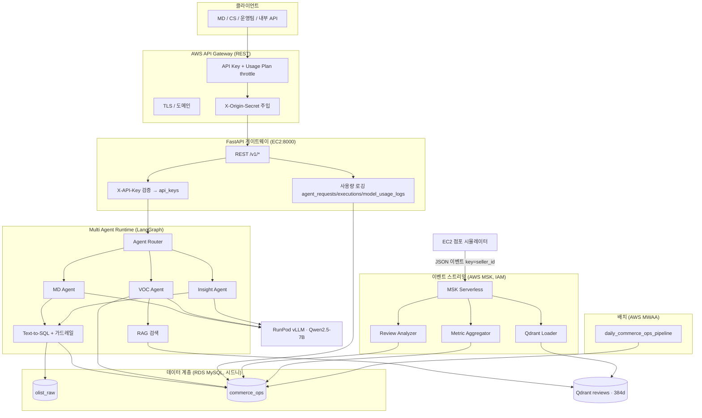
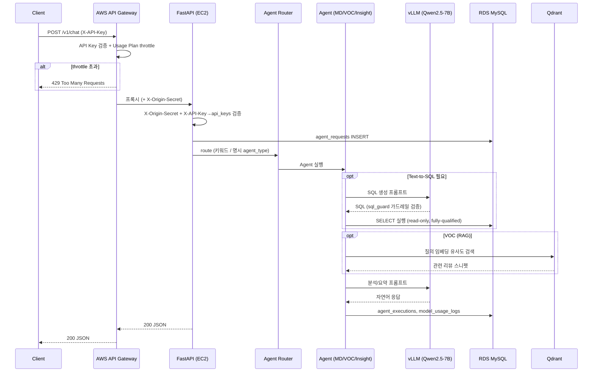
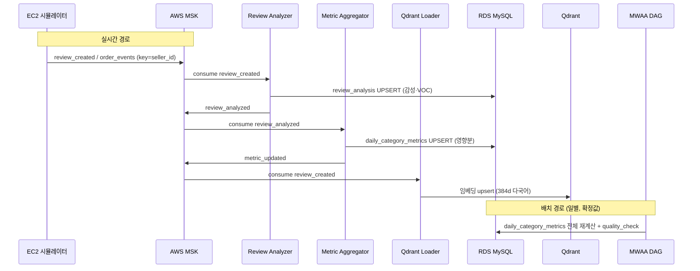
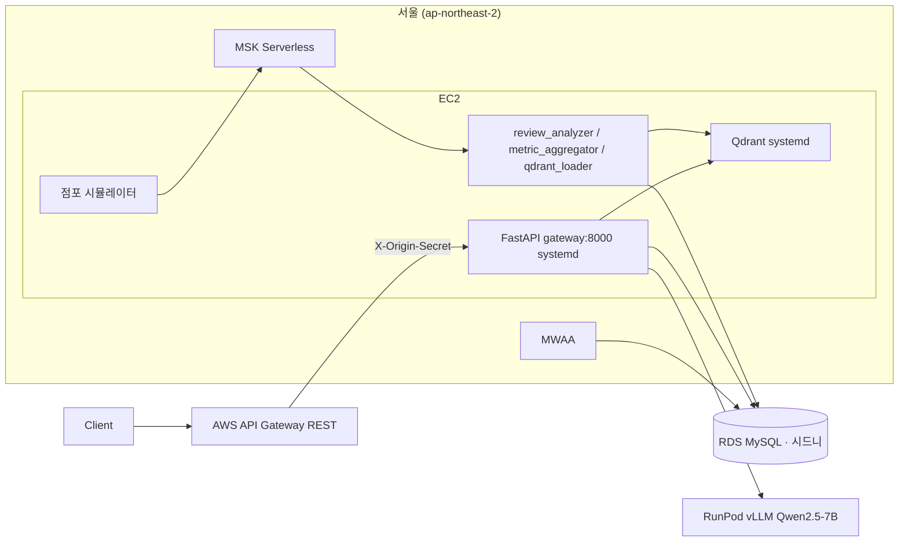

> **상태:** 구현 반영(REALIGNED) — 실제 스택: RDS MySQL · MSK(IAM) · MWAA · RunPod vLLM(Qwen2.5-7B) · Qdrant · AWS API Gateway. 본 문서는 실제 구현 기준으로 재작성됨. 완성도는 [PROGRESS.md §8](../PROGRESS.md), 스택 매핑은 [§9](../PROGRESS.md) 참조.

# 시스템 아키텍처

| 항목 | 내용 |
|------|------|
| 문서 버전 | 2.0 (REALIGNED) |
| 작성일 | 2026-05-31 |
| 참조 | [PROJECT.md](./PROJECT.md), [PRD.md](./PRD.md), [PROGRESS.md](../PROGRESS.md) |

---

## 1. 아키텍처 목표

- **단일 진입점**: **AWS API Gateway(REST)** 가 인증(API Key)·throttle(Usage Plan)·TLS를 **관리형**으로 일원화한다. FastAPI는 에이전트 실행·사용량 로깅에 집중한다.
- **관심사 분리**: 동기(에이전트 질의)와 비동기(MSK 스트리밍·MWAA 배치)를 분리해 에이전트 응답 지연을 줄인다.
- **람다 아키텍처**: 스트림(영향분 근사·실시간)과 배치(전체 재계산·확정)가 동일한 `daily_category_metrics`로 수렴한다.
- **재정렬 메모**: 원안의 Redis(캐시/세션/Rate Limit)는 미도입 — **Rate Limit은 API Gateway Usage Plan**으로 대체, 캐시/세션은 미구현(TODO). LLM은 OpenAI/Claude 대신 **RunPod vLLM(Qwen2.5-7B)**.

---

## 2. 논리 컴포넌트 다이어그램

> Usage Logger 컨슈머는 설계상 존재하나 **미구현**([TODO.md](../TODO.md) P2). 토큰·비용은 현재 미기록.

---

## 3. 동기 요청 흐름 (API Gateway → FastAPI → Agent → DB)

사용자 질의는 **동기 HTTP**로 처리된다. 인증·throttle은 엣지(API Gateway)에서, 에이전트 실행·로깅은 FastAPI에서 수행한다.

### 3.1 주요 설계 결정

| 결정 | 내용 | 근거 |
|------|------|------|
| 인증·throttle | **API Gateway에서 처리**(API Key + Usage Plan), FastAPI는 X-API-Key로 사용량만 연결 | 관리형으로 단순화([PROGRESS §9](../PROGRESS.md)) |
| 우회 차단 | API Gateway가 `X-Origin-Secret` 주입, FastAPI 미들웨어가 검증 | EC2 직접 호출 차단 |
| DB 읽기 | Agent는 `commerce_ops` 우선, 원시는 `olist_raw` 조인 | 사전 집계로 지연 감소 |
| SQL 실행 | Gateway가 아닌 Agent Runtime, 가드레일(`sql_guard.py`) 적용 | [AGENTS.md](./AGENTS.md) |
| 캐시 | **미구현** — 질의 해시 캐시는 POST 본문 기반이라 API Gateway 캐시로 대체 불가 | [TODO.md](../TODO.md) P3 |

> 실측 지연: `/v1/chat` 성공 ~7~16s (vLLM 2~3회 + 교차리전 RDS). PRD 목표 P95 < 10s는 캐시·튜닝 후 재검증 필요.

---

## 4. 비동기 흐름 (Simulator → MSK → Consumers / MWAA)

리뷰 분석·임베딩·일별 집계는 **이벤트·배치**로 처리해 실시간 API 경로와 분리한다.

상세 토픽·페이로드는 [KAFKA.md](./KAFKA.md), DAG는 [AIRFLOW.md](./AIRFLOW.md) 참조.

---

## 5. 레이어별 책임

### 5.1 AWS API Gateway (REST) — 앞단

| 책임 | 구현 |
|------|------|
| 인증 | API Key + Usage Plan (키별 throttle/quota) |
| TLS·도메인·WAF | 관리형 |
| 백엔드 연결 | `{proxy+}` HTTP_PROXY → EC2(또는 VPC Link→NLB), `X-Origin-Secret` 주입 |

IaC: `infra/terraform/api-gateway/`.

### 5.2 FastAPI 게이트웨이 (`src/gateway/app.py`)

| 책임 | 구현 |
|------|------|
| REST `/v1/*` + `/health` | ✅ |
| 인증 | `X-API-Key` → SHA-256 → `commerce_ops.api_keys` |
| 우회 차단 | `X-Origin-Secret` 미들웨어 |
| 사용량 로깅 | `agent_requests`/`agent_executions`/`model_usage_logs` (토큰·비용은 TODO) |

### 5.3 Multi Agent Runtime (`src/agents/`)

| Agent | 입력 | 데이터 소스 |
|-------|------|-------------|
| MD | 매출·상품·카테고리 | `daily_category_metrics`, `order_items` 등 |
| VOC | 리뷰·VOC | `review_analysis` + **Qdrant RAG** + `reviews` |
| Insight | KPI·원인 | `daily_category_metrics` 집계 |

LangGraph: `route → retrieve(Text-to-SQL + RAG) → synthesize(vLLM)`. 라우팅·가드레일: [AGENTS.md](./AGENTS.md).

### 5.4 RDS MySQL (이중 스키마, 단일 인스턴스 · 시드니)

| 스키마 | 용도 |
|--------|------|
| `olist_raw` | Olist CSV 원본, Text-to-SQL 원천 (8테이블) |
| `commerce_ops` | 운영·집계·Agent 로그 (`review_analysis`, `daily_category_metrics`, `api_keys` 등) |

> 단일 연결로 `olist_raw.x ⋈ commerce_ops.y` 교차 스키마 조인 가능. MSK·MWAA(서울) ↔ RDS(시드니) **교차리전**(데모 구성). [DATA.md](./DATA.md), [ERD.md](./ERD.md).

### 5.5 MSK Consumers (`src/consumers/`)

| Worker | 구독 | 역할 |
|--------|------|------|
| Review Analyzer | `review_created` | 감성·VOC → `review_analysis` → `review_analyzed` |
| Metric Aggregator | `review_analyzed` | 교차스키마 집계 → `daily_category_metrics` → `metric_updated` |
| Qdrant Loader | `review_created` | 임베딩 → Qdrant upsert |
| ~~Usage Logger~~ | `metric_updated` | **미구현** (TODO P2) |

### 5.6 MWAA (Airflow)

- DAG `daily_commerce_ops_pipeline` (`dags/`): `aggregate_daily_metrics`(전체 재계산) → `quality_check`. 스케줄 `@daily`.
- `daily_category_metrics`의 **배치 정본(확정값)** — 스트림 근사분을 보정.
- (현재 2태스크로 단순화; 문서 원안 7태스크 아님 — [AIRFLOW.md](./AIRFLOW.md))

### 5.7 Qdrant · vLLM (외부 자원)

| 자원 | 용도 |
|------|------|
| Qdrant (셀프호스트) | `reviews` 컬렉션(384d Cosine), RAG 검색 |
| RunPod vLLM | Qwen2.5-7B-Instruct, OpenAI 호환. Cloudflare 회피 UA 필수(`common/llm.py`) |

### 5.8 Redis — 미도입

Rate Limit은 API Gateway Usage Plan으로 대체. 캐시·세션은 **미구현**([TODO.md](../TODO.md) P3).

---

## 6. 배포 뷰 (실제)

서비스 목록·기동 절차: [DEPLOYMENT.md](./DEPLOYMENT.md).

---

## 7. 보안·관측성 (아키텍처 관점)

| 영역 | 실제 |
|------|------|
| 인증 | API Gateway API Key + FastAPI `X-API-Key`(→api_keys). **JWT 미구현** |
| 우회 차단 | `X-Origin-Secret` (API Gateway 주입 ↔ FastAPI 검증) |
| 스트리밍 인증 | MSK **IAM (OAUTHBEARER)** |
| 비밀 | `.env`(Git 미포함) — RDS/vLLM/Qdrant 자격, MWAA는 Airflow Variable |
| 감사 | `agent_requests`, `agent_executions`, `model_usage_logs` |
| 로그 | loguru 구조화 → `/workspace/app_logs/{app}/` |

---

## 8. 확장·제약 (v1)

| In Scope | Out of Scope (v1) |
|----------|-------------------|
| 단일 EC2(시뮬·게이트웨이·컨슈머·Qdrant) + 관리형(MSK/RDS/MWAA) | K8s, 멀티 AZ, Auto Scaling |
| MSK Serverless(IAM) | 멀티 클러스터 |
| vLLM 단일 RunPod 엔드포인트 | 멀티 모델 라우팅·과금 |
| 교차리전(서울↔시드니, 데모) | 동일 리전 최적화(운영 권장) |

---

## 9. 구현 현황 (Day별 매핑)

| 일차 | 구성요소 | 상태 |
|------|----------|------|
| Day 1 | RDS MySQL 이중 스키마, ERD/DDL | ✅ |
| Day 2 | FastAPI 게이트웨이 + (Redis 대신) API Gateway | 🟡 (캐시·토큰비용 TODO) |
| Day 3 | Agent Router + 3 Agents + Text-to-SQL + RAG | ✅ |
| Day 4 | MSK + Consumers | 🟡 (Usage Logger 미구현) |
| Day 5 | MWAA DAG + API Gateway IaC | 🟡 (k6·Compose 미구현) |

완성도 상세: [PROGRESS.md §8](../PROGRESS.md).

---

## 10. 변경 이력

| 버전 | 날짜 | 변경 |
|------|------|------|
| 1.0 | 2026-05-31 | PROJECT §5 기반 사전 설계 초안 (PG/Redis/Compose 전제) |
| 2.0 | 2026-05-31 | **REALIGNED** — 실제 스택(RDS MySQL/MSK/MWAA/vLLM/Qdrant/API Gateway)으로 본문·다이어그램 재작성 |
