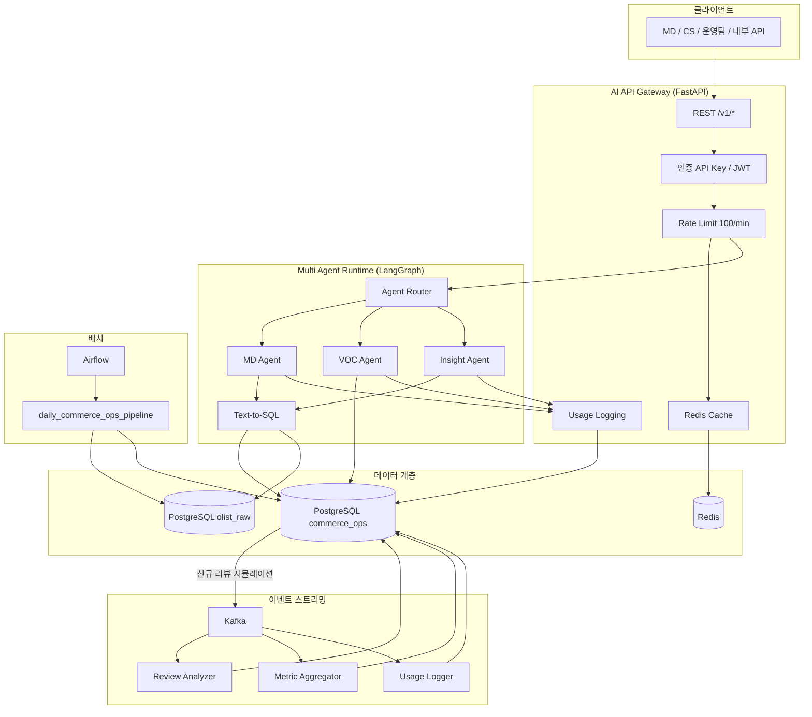
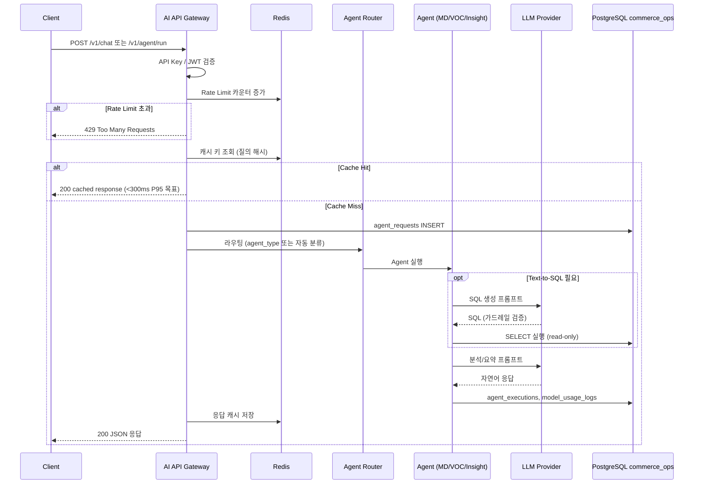
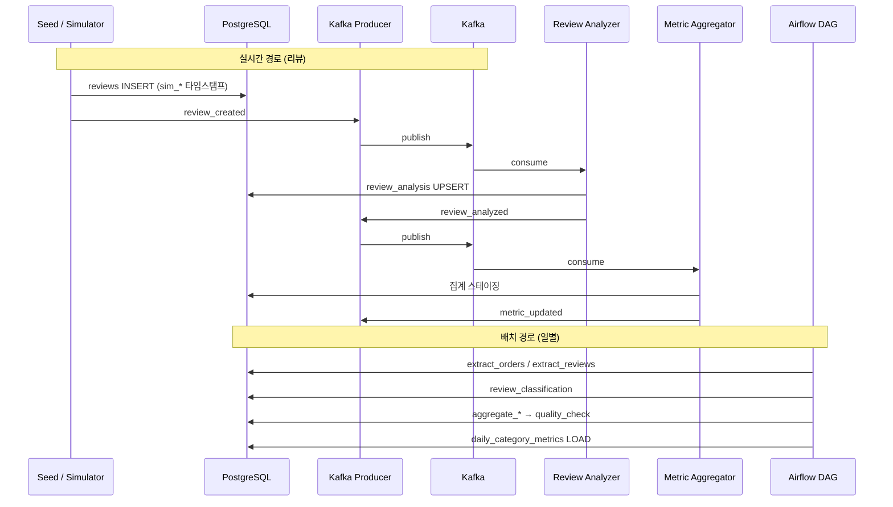
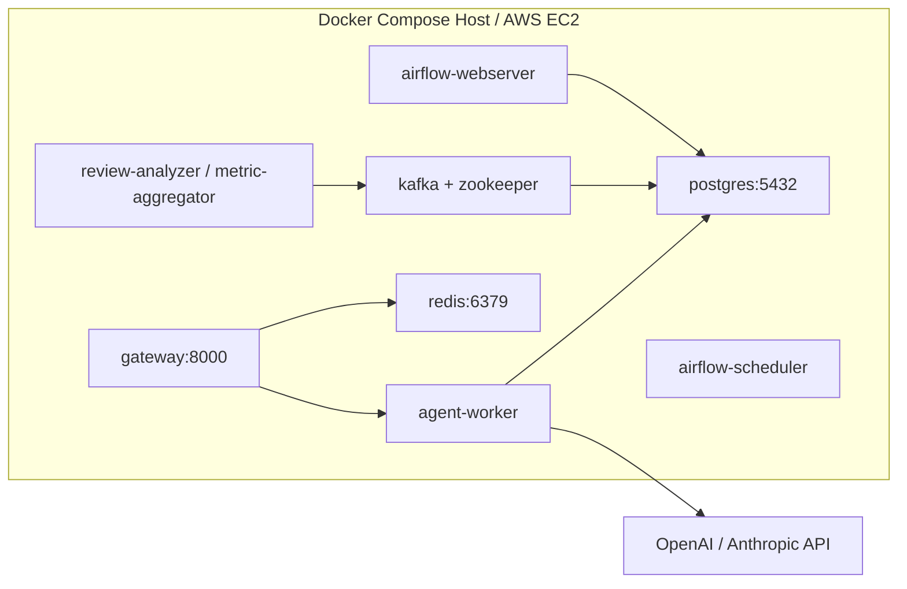

> **상태:** Draft (Pre-implementation)

# 시스템 아키텍처

| 항목 | 내용 |
|------|------|
| 문서 버전 | 1.0 |
| 작성일 | 2026-05-31 |
| 참조 | [PROJECT.md §5](./PROJECT.md), [PRD.md](./PRD.md) |

---

## 1. 아키텍처 목표

- **단일 진입점**: AI API Gateway가 인증·Rate Limit·캐시·사용량 추적을 일원화한다.
- **관심사 분리**: 동기(Agent 질의)와 비동기(Kafka·Airflow) 경로를 분리해 Agent 응답 지연을 줄인다.
- **수평 확장**: Gateway·Agent Worker·Kafka Consumer는 인스턴스 추가로 확장 가능한 구조를 목표로 한다. (v1은 Docker Compose 단일 노드)

---

## 2. 논리 컴포넌트 다이어그램

---

## 3. 동기 요청 흐름 (Gateway → Agent → DB)

사용자 질의는 **동기 HTTP**로 처리되며, 캐시 적중 시 Agent·LLM 호출을 생략한다.

### 3.1 주요 설계 결정

| 결정 | 내용 | 근거 |
|------|------|------|
| 캐시 키 | `hash(normalized_query + agent_type + model)` | 동일 질의 재사용 (PRD GW-03) |
| DB 읽기 | Agent는 `commerce_ops` 우선, 원시 집계는 `olist_raw` 조인 | 사전 집계 테이블로 Agent 지연 감소 |
| SQL 실행 | Gateway가 아닌 Agent Runtime에서 실행, 가드레일 적용 | [AGENTS.md](./AGENTS.md) 참조 |
| 세션 | Redis에 `session_id`별 대화 이력 (선택) | 후속 turn 컨텍스트 — v1 최소 구현 |

> **TODO (구현 후):** 실제 P95·캐시 TTL·세션 TTL을 k6·APM으로 검증하고 본 문서에 수치 반영.

---

## 4. 비동기 흐름 (DB → Kafka → Workers → Airflow)

리뷰 분석·일별 집계는 **이벤트·배치**로 처리해 실시간 API 경로와 분리한다.

상세 토픽·페이로드는 [KAFKA.md](./KAFKA.md), DAG 태스크는 [AIRFLOW.md](./AIRFLOW.md)를 참조한다.

---

## 5. 레이어별 책임

### 5.1 AI API Gateway

| 책임 | 구현 위치 (예정) | 문서 |
|------|-----------------|------|
| REST API | `gateway/` 또는 `app/api/` | [API.md](./API.md) |
| 인증·Rate Limit | Middleware + Redis | [API.md §인증](./API.md) |
| 캐시 | Redis `cache:{key}` | [API.md §캐시](./API.md) |
| 사용량 API | `model_usage_logs` 집계 | [API.md](./API.md) |

### 5.2 Multi Agent Runtime

| Agent | 입력 | 출력 | 데이터 소스 |
|-------|------|------|-------------|
| MD Agent | 매출·상품·카테고리 질의 | 표 + 인사이트 | `order_items`, `daily_category_metrics` 등 |
| VOC Agent | 리뷰·VOC 질의 | 감성·VOC 분류 요약 | `reviews`, `review_analysis` |
| Insight Agent | KPI·원인 분석 | 리포트 형태 JSON/마크다운 | `daily_category_metrics`, 집계 테이블 |

라우팅·가드레일: [AGENTS.md](./AGENTS.md)

### 5.3 PostgreSQL (이중 DB)

| DB | 용도 |
|----|------|
| `olist_raw` | Olist CSV 원본 적재, Text-to-SQL 원천 |
| `commerce_ops` | 운영·집계·Agent 로그, 시뮬레이션 컬럼 |

[DATA.md](./DATA.md), [ERD.md](./ERD.md)

### 5.4 Kafka Workers

| Worker | Topic 구독 | 역할 |
|--------|------------|------|
| Review Analyzer | `review_created` | 감성·VOC → `review_analysis` |
| Metric Aggregator | `review_analyzed` | 카테고리/매출 스테이징 |
| Usage Logger | `metric_updated` (및 Gateway 직접 기록) | 토큰·비용 보강 |

### 5.5 Airflow

- DAG ID: `daily_commerce_ops_pipeline`
- 스케줄: 매일 02:00 UTC (조정 가능) — [AIRFLOW.md](./AIRFLOW.md)
- Agent가 조회하는 `daily_category_metrics` 등 사전 집계의 **정본(source of truth)** 역할

### 5.6 Redis

| 용도 | 키 패턴 (예정) |
|------|----------------|
| 응답 캐시 | `cache:query:{sha256}` |
| Rate Limit | `ratelimit:{api_key_id}:{minute_bucket}` |
| 세션 | `session:{session_id}` |

---

## 6. 배포 뷰 (논리)

서비스 목록·시작 순서: [DEPLOYMENT.md](./DEPLOYMENT.md)

---

## 7. 보안·관측성 (아키텍처 관점)

| 영역 | v1 설계 |
|------|---------|
| 인증 | `Authorization: Bearer` (JWT) 또는 `X-API-Key` |
| 비밀 | `.env` — API 키·DB 비밀번호, Git 미포함 |
| 감사 | `agent_requests`, `agent_executions`, `model_usage_logs` |
| 로그 | 구조화 JSON (request_id, agent_type, latency_ms) — **TODO:** 로그 스키마 구현 후 확정 |

---

## 8. 확장·제약 (v1)

| In Scope | Out of Scope (v1) |
|----------|-------------------|
| 단일 EC2 + Compose | K8s, 멀티 AZ |
| Kafka 단일 브로커 | MSK 클러스터 |
| OpenAI/Claude 단일 계정 | 멀티 테넌트 과금 |

---

## 9. 구현 체크리스트 (Day별 매핑)

| 일차 | 아키텍처 구성요소 |
|------|-------------------|
| Day 1 | PostgreSQL 이중 DB, ERD/DDL |
| Day 2 | Gateway + Redis |
| Day 3 | Agent Router + 3 Agents + Text-to-SQL |
| Day 4 | Kafka + Workers |
| Day 5 | Airflow DAG + Compose + k6 |

---

## 10. 변경 이력

| 버전 | 날짜 | 변경 |
|------|------|------|
| 1.0 | 2026-05-31 | PROJECT §5 기반 사전 설계 초안 |
