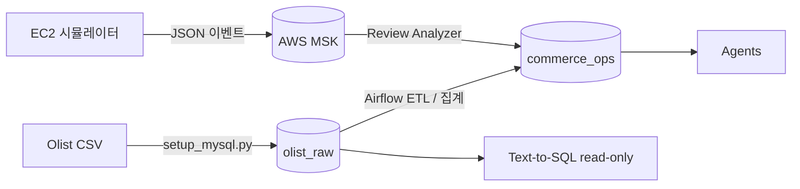
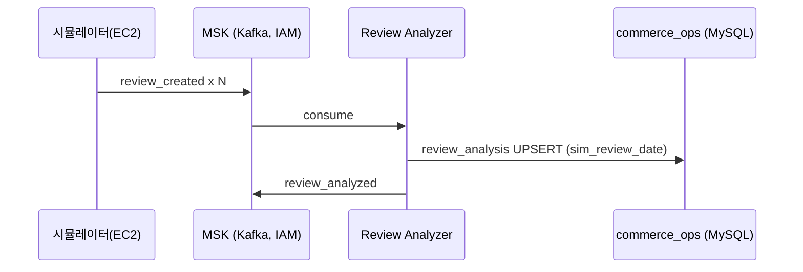

> **상태:** 구현 반영(REALIGNED) — 실제 스택: RDS MySQL · MSK(IAM) · MWAA · RunPod vLLM(Qwen2.5-7B) · Qdrant · AWS API Gateway. 본 문서의 PostgreSQL/Redis/Docker Compose/OpenAI·Claude 언급은 구현과 다름 — 스택 매핑·완성도는 [PROGRESS.md](../PROGRESS.md) 참조.

# 데이터 전략 (Olist · 시뮬레이션 · MSK)

| 항목 | 내용 |
|------|------|
| 문서 버전 | 2.0 |
| 작성일 | 2026-05-31 |
| DB | **RDS MySQL 8.4** (Sydney) — 단일 인스턴스, 두 스키마 `olist_raw` + `commerce_ops`. InnoDB / utf8mb4. 드라이버 `pymysql`. |
| 스트리밍 | **AWS MSK** (Kafka, IAM 인증) |
| 시드/적재 | **`scripts/setup_mysql.py`** (Docker seed 서비스 아님) |
| 관련 | [ERD.md](./ERD.md), [KAFKA.md](./KAFKA.md), [AIRFLOW.md](./AIRFLOW.md), [TODO.md](../TODO.md), [PROGRESS.md](../PROGRESS.md) |

> DDL 원본(Source of Truth): `db/schema/mysql/olist_raw.sql`, `db/schema/mysql/commerce_ops.sql`, `db/schema/mysql/commerce_ops_agent.sql`. 본 문서의 타입·컬럼은 해당 DDL을 따른다.

---

## 1. 데이터셋 출처

### 1.1 Olist Brazilian E-Commerce

| 항목 | 내용 |
|------|------|
| 출처 | [Kaggle: Brazilian E-Commerce Public Dataset by Olist](https://www.kaggle.com/datasets/olistbr/brazilian-ecommerce) |
| 라이선스 | 프로젝트 내부·데모 용도 (배포 시 라이선스 재확인 — [TODO.md](../TODO.md)) |
| 기간 | 실제 데이터 약 2016-09 ~ 2018-10 |
| 범위 | 아래 8개 테이블만 `olist_raw`에 적재 |

### 1.2 사용 테이블 (8종, `olist_raw`)

`scripts/setup_mysql.py` 의 `LOAD` 목록 + `reviews`(별도, `review_id` 중복 제거) 순으로 적재한다.

| 테이블 | CSV 파일명 | 용도 |
|--------|-----------|------|
| `category_translation` | `product_category_name_translation.csv` | 영문 카테고리 |
| `customers` | `olist_customers_dataset.csv` | 고객·지역 |
| `sellers` | `olist_sellers_dataset.csv` | 판매자 |
| `products` | `olist_products_dataset.csv` | SKU·카테고리 |
| `orders` | `olist_orders_dataset.csv` | 주문·배송 상태 |
| `order_items` | `olist_order_items_dataset.csv` | 라인아이템·GMV |
| `payments` | `olist_order_payments_dataset.csv` | 결제 수단 |
| `reviews` | `olist_order_reviews_dataset.csv` | VOC 원천 (`review_id` 기준 dedup) |

미사용 (Out of Scope): `geolocation` 등 추가 Olist 확장 테이블.

---

## 2. DB 분리: `olist_raw` vs `commerce_ops`

단일 RDS MySQL 8.4 인스턴스 위에 **두 개의 스키마(데이터베이스)** 를 둔다. Cross-DB FK는 사용하지 않으며, Agent·Airflow는 ETL/조회로 `olist_raw`를 참조한다.



| DB (스키마) | 역할 | 쓰기 주체 |
|----|------|-----------|
| `olist_raw` | 불변에 가까운 원본 스냅샷 (8 테이블) | `setup_mysql.py` bulk load |
| `commerce_ops` | 로그·분석·집계·인증·시뮬레이션 컬럼 | Gateway, Kafka 워커(MSK), Airflow(MWAA), 시뮬레이터 |

**이유**

- 원본 오염 방지 (Agent Text-to-SQL 실수 시 영향 격리)
- 운영 테이블 마이그레이션을 Olist 스키마와 독립
- 데모 시 `sim_*` 컬럼만 갱신해 "오늘" 데이터처럼 보이게 함

---

## 3. Seed / 적재 (`scripts/setup_mysql.py`)

**단일 스크립트** 가 스키마 적용 + CSV 적재를 멱등하게 수행한다. (별도 `make seed`·Docker seed 서비스 없음.)

```bash
python scripts/setup_mysql.py
```

동작 순서:

1. `.env`의 `MYSQL_*` / `OLIST_DATA_DIR` 로 `pymysql` 연결(`src/common/db.py:mysql_conn`, `autocommit=False`).
2. DDL 적용 — `db/schema/mysql/olist_raw.sql`, `db/schema/mysql/commerce_ops.sql` 을 `;` 단위로 실행(주석 제거). 두 파일 모두 `CREATE DATABASE IF NOT EXISTS ... CHARACTER SET utf8mb4` + `USE` 포함.
3. `olist_raw` 8개 테이블을 **`TRUNCATE` 후 `executemany` 배치(2000행)** 로 재적재 → 멱등. `reviews`는 `review_id` 기준 중복 제거 후 적재.
4. INT/DECIMAL 컬럼은 `_cast()`로 형 변환, 빈 문자열·`NaN`은 `NULL` 처리.
5. 적재 후 테이블별 `COUNT(*)` 로깅.

| 순서 | 테이블 | DB | 비고 |
|------|--------|-----|------|
| 1 | `category_translation` | olist_raw | products보다 선행 |
| 2 | `customers` | olist_raw | |
| 3 | `sellers` | olist_raw | |
| 4 | `products` | olist_raw | |
| 5 | `orders` | olist_raw | |
| 6 | `order_items` | olist_raw | |
| 7 | `payments` | olist_raw | |
| 8 | `reviews` | olist_raw | `review_id` dedup |

> **참고:** `olist_raw`는 대량 적재 단순화를 위해 FK를 두지 않고 인덱스만 유지한다(적재 순서로 무결성 보장). DDL 헤더 주석 참조.

### 3.1 `commerce_ops` 부트스트랩

- `commerce_ops.sql`(분석·집계 테이블: `review_analysis`, `daily_category_metrics`)은 `setup_mysql.py`가 함께 적용한다.
- **인증·로깅·프롬프트 테이블**(`api_keys`, `prompt_versions`, `agent_requests`, `agent_executions`, `model_usage_logs`)은 `db/schema/mysql/commerce_ops_agent.sql`에 정의되어 **Gateway/Agent 단계에서 별도 적용**한다(`setup_mysql.py`는 적용하지 않음). 동 파일이 데모 `api_keys`를 `INSERT IGNORE` + `SHA2(...,256)` 해시로 멱등 시드한다.
- `daily_category_metrics`는 Airflow 첫 실행 전 비어 있을 수 있다.

---

## 4. 시간 시프트·시뮬레이션 전략

Olist 원본 타임스탬프는 2016~2018이다. 데모·부하 테스트에서 "이번 달", "최근 7일" 질의가 동작하려면 **시뮬레이션 달력**을 사용한다.

### 4.1 환경 변수 `SIM_TODAY`

| 변수 | 예시 | 설명 |
|------|------|------|
| `SIM_TODAY` | `2026-05-31` | 플랫폼 기준 "오늘" (DATE) |
| `SIM_TZ` | `America/Sao_Paulo` | 리포트 타임존 (선택) |

모든 "최근 N일" 계산은 MySQL `CURDATE()` 대신 **`SIM_TODAY`** 를 사용한다.

### 4.2 `sim_*` 컬럼 (구현됨)

원본 타임스탬프를 보존하면서, 분석 테이블에 시뮬레이션 날짜 컬럼을 둔다.

| 컬럼 | 위치 | 타입(MySQL) | 계산 |
|------|------|------|------|
| `sim_review_date` | `commerce_ops.review_analysis` | `DATE` | `review_creation_date`를 `SIM_TODAY` 기준 선형 시프트 (구현됨, `idx_ra_date` 인덱스) |

**시프트 공식 (MySQL)**

```sql
-- shift_days = SIM_TODAY - (원본 리뷰 최대일)
SET @shift := DATEDIFF('2026-05-31', (SELECT MAX(DATE(review_creation_date)) FROM olist_raw.reviews));
-- sim_review_date = DATE(review_creation_date) + shift_days
-- → DATE_ADD(DATE(review_creation_date), INTERVAL @shift DAY)
```

동일 `shift_days`를 주문 타임라인에도 적용하면 주문·리뷰 정합성을 유지할 수 있다.

> **미구현/계획:** 원래 설계의 `sim_order_date` / `sim_days_ago` 컬럼과 시뮬레이션 **VIEW**(`v_orders_sim` / `v_reviews_sim`)는 **생성하지 않았다**. 현재는 `review_analysis.sim_review_date` 단일 컬럼만 사용한다. 추가 시프트 컬럼·뷰는 [TODO.md](../TODO.md) 참조.

### 4.3 증분 시뮬레이션 (리뷰 대량 발행)

데모·부하 시나리오(리뷰 폭주)용 흐름:

1. EC2 시뮬레이터가 `seller_id` 키로 리뷰 이벤트(JSON)를 생성(TAF 가속 / 합성 복제 / 다중 샤드).
2. **AWS MSK**(IAM 인증)로 `review_created` 토픽에 발행 — [KAFKA.md](./KAFKA.md).
3. Review Analyzer가 소비 → `commerce_ops.review_analysis` 에 멱등 UPSERT(`sim_review_date` 포함).

| 모드 | 용도 |
|------|------|
| `full` | 전체 CSV reload (`setup_mysql.py`) |
| `incremental` | 시뮬레이터 → MSK 리뷰 이벤트 스트림 |

---

## 5. Agent·Airflow가 보는 데이터

| 소비자 | 우선 데이터 | 폴백 |
|--------|-------------|------|
| MD Agent | `commerce_ops.daily_category_metrics`, `olist_raw.order_items` | olist_raw 조인 |
| VOC Agent | `commerce_ops.review_analysis` | 미처리 시 `olist_raw.reviews` 원문 |
| Insight Agent | `commerce_ops.daily_category_metrics` 다일 추세 | — |
| Airflow (MWAA) | `olist_raw` 읽기 → `commerce_ops` 쓰기 | — |

---

## 6. MSK 스트리밍 개요

부하 테스트·데모에서 리뷰 이벤트를 스트리밍/재생한다. 브로커는 **AWS MSK**, 인증은 **IAM** 이다.



| 파라미터 | 권장 |
|----------|------|
| Topic | `review_created` |
| 파티션 키 | `seller_id` |
| 멱등성 | 동일 `review_id` → `ON DUPLICATE KEY UPDATE` (PK=`review_id`) |

상세 스키마·재생: [KAFKA.md](./KAFKA.md)

---

## 7. 데이터 품질·제약

| 규칙 | 담당 |
|------|------|
| 일별 집계 NULL/음수 없음 | Airflow `quality_check` |
| `review_score` 1~5 | 적재 시 검증 (DB CHECK 미적용) |
| 멱등 적재 | `olist_raw`: `TRUNCATE` 후 재적재 / `review_analysis`: `ON DUPLICATE KEY UPDATE` |
| Text-to-SQL 범위 | `olist_raw` + `commerce_ops` 화이트리스트 (read-only) — [AGENTS.md](./AGENTS.md) |

---

## 8. 용량 가정 (5일 프로젝트)

| 항목 | 대략적 규모 |
|------|-------------|
| orders | ~100k |
| reviews | ~100k (dedup 후) |
| RDS MySQL(InnoDB) 디스크 | 2~5 GB (인덱스 포함, 추정) |

> **계획:** 실제 CSV 적재 후 `information_schema.tables`(`DATA_LENGTH + INDEX_LENGTH`)로 스키마별 용량 기록 — [TODO.md](../TODO.md).

---

## 9. 변경 이력

| 버전 | 날짜 | 변경 |
|------|------|------|
| 1.0 | 2026-05-31 | 데이터 전략 초안 (PostgreSQL 기준) |
| 2.0 | 2026-05-31 | REALIGNED — MySQL/실제 스키마 반영 |
