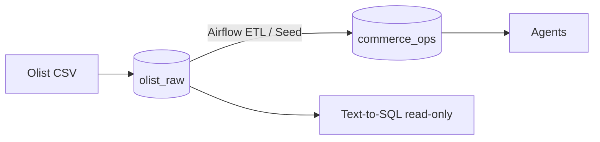
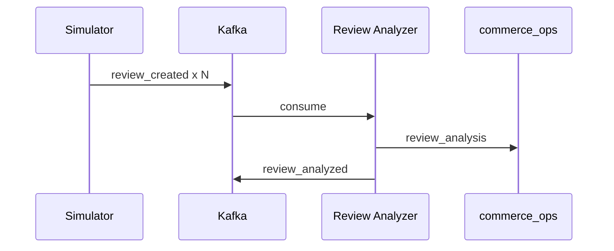

> **상태:** Draft (Pre-implementation)

# 데이터 전략 (Olist · 시뮬레이션 · Kafka)

| 항목 | 내용 |
|------|------|
| 문서 버전 | 1.0 |
| 작성일 | 2026-05-31 |
| 관련 | [ERD.md](./ERD.md), [KAFKA.md](./KAFKA.md), [AIRFLOW.md](./AIRFLOW.md) |

---

## 1. 데이터셋 출처

### 1.1 Olist Brazilian E-Commerce

| 항목 | 내용 |
|------|------|
| 출처 | [Kaggle: Brazilian E-Commerce Public Dataset by Olist](https://www.kaggle.com/datasets/olistbr/brazilian-ecommerce) |
| 라이선스 | 프로젝트 내부·데모 용도 (배포 시 라이선스 재확인 **TODO**) |
| 기간 | 실제 데이터 약 2016-09 ~ 2018-10 |
| v1 범위 | 아래 8개 테이블만 사용 |

### 1.2 사용 테이블

| 테이블 | CSV (일반적 파일명) | 용도 |
|--------|---------------------|------|
| `customers` | `olist_customers_dataset.csv` | 고객·지역 |
| `orders` | `olist_orders_dataset.csv` | 주문·배송 상태 |
| `order_items` | `olist_order_items_dataset.csv` | 라인아이템·GMV |
| `products` | `olist_products_dataset.csv` | SKU·카테고리 |
| `reviews` | `olist_order_reviews_dataset.csv` | VOC 원천 |
| `payments` | `olist_order_payments_dataset.csv` | 결제 수단 |
| `sellers` | `olist_sellers_dataset.csv` | 판매자 |
| `category_translation` | `product_category_name_translation.csv` | 영문 카테고리 |

미사용 (v1 Out of Scope): `geolocation`, `order_reviews` 외 추가 Olist 확장 테이블.

---

## 2. DB 분리: `olist_raw` vs `commerce_ops`



| DB | 역할 | 쓰기 주체 |
|----|------|-----------|
| `olist_raw` | 불변에 가까운 원본 스냅샷 | Day1 bulk seed |
| `commerce_ops` | 로그·분석·집계·시뮬레이션 | Gateway, Workers, Airflow, Simulator |

**이유**

- 원본 오염 방지 (Agent SQL 실수 시 `commerce_ops`만 영향 최소화)
- 운영 테이블 마이그레이션을 Olist 스키마와 독립
- 데모 시 `sim_*` 컬럼만 갱신해 “오늘” 데이터처럼 보이게 함

---

## 3. Seed 순서

FK 의존성을 지키며 **truncate 후 재적재** 또는 최초 bulk load.

| 순서 | 테이블 | DB | 비고 |
|------|--------|-----|------|
| 1 | `category_translation` | olist_raw | products보다 선행 |
| 2 | `customers` | olist_raw | |
| 3 | `sellers` | olist_raw | |
| 4 | `products` | olist_raw | |
| 5 | `orders` | olist_raw | |
| 6 | `order_items` | olist_raw | |
| 7 | `payments` | olist_raw | |
| 8 | `reviews` | olist_raw | |
| 9 | `api_keys` (샘플) | commerce_ops | 해시만 저장 |
| 10 | `prompt_versions` (시드) | commerce_ops | MD/VOC/Insight 기본 프롬프트 |
| 11 | `daily_category_metrics` (선택 백필) | commerce_ops | Airflow 첫 실행 전 비어 있을 수 있음 |

### 3.1 Seed 스크립트 위치 (예정)

```text
db/seed/olist/00_download.sh      # CSV 다운로드 (수동 URL 가능)
db/seed/olist/10_load_raw.sql     # \copy 또는 COPY
db/seed/commerce_ops/20_bootstrap.sql
```

> **TODO (구현):** `make seed` 또는 `docker compose run seed` 단일 명령으로 통합.

---

## 4. 시간 시프트·시뮬레이션 전략

Olist 원본 타임스탬프는 2016~2018이다. 데모·부하 테스트에서 “이번 달”, “최근 7일” 질의가 동작하려면 **시뮬레이션 달력**을 도입한다.

### 4.1 환경 변수 `SIM_TODAY`

| 변수 | 예시 | 설명 |
|------|------|------|
| `SIM_TODAY` | `2026-05-31` | 플랫폼 기준 “오늘” (DATE) |
| `SIM_TZ` | `America/Sao_Paulo` | 리포트 타임존 (선택) |

모든 “최근 N일” 계산은 `CURRENT_DATE` 대신 **`SIM_TODAY`** 를 사용한다.

### 4.2 `sim_*` 컬럼 (commerce_ops 또는 reviews 확장)

| 컬럼 | 타입 | 계산 |
|------|------|------|
| `sim_order_date` | DATE | `order_purchase_timestamp`를 SIM_TODAY 기준으로 선형 시프트 |
| `sim_review_date` | DATE | `review_creation_date` 시프트 |
| `sim_days_ago` | INT | `SIM_TODAY - sim_review_date` |

**시프트 공식 (초안)**

```text
shift_days = (SIM_TODAY - max(original_review_date))
sim_review_date = review_creation_date::date + shift_days
```

동일 `shift_days`를 orders에 적용해 주문·리뷰 타임라인 정합성 유지.

### 4.3 Incremental Seed (증분 시뮬레이션)

데모·시나리오 4(리뷰 대량 발행)용:

1. 기존 `reviews`에서 N건 샘플 또는 합성 `review_id` 생성
2. `sim_review_date = SIM_TODAY` 또는 `SIM_TODAY - random(0..6)`
3. `commerce_ops.reviews` 스테이징 INSERT (또는 raw + sim 뷰)
4. **Kafka** `review_created` 발행 — [KAFKA.md §Replay](./KAFKA.md)

| 모드 | 명령 (예정) | 용도 |
|------|-------------|------|
| `full` | 전체 CSV reload | Day1 |
| `incremental` | N건/분 리뷰 + 이벤트 | k6 시나리오 4 |

> **TODO (구현):** `scripts/simulate_reviews.py --count 1000 --rate 100/min`

---

## 5. Agent·Airflow가 보는 데이터

| 소비자 | 우선 데이터 | 폴백 |
|--------|-------------|------|
| MD Agent | `daily_category_metrics`, `order_items`+sim | olist_raw 조인 |
| VOC Agent | `review_analysis`, `reviews`+sim | 실시간 Kafka 미처리 시 원문 |
| Insight Agent | `daily_category_metrics` 다일 | — |
| Airflow | olist_raw 읽기 → commerce_ops 쓰기 | — |

---

## 6. Kafka Replay 개요

부하 테스트·데모에서 과거 이벤트를 재생한다.



| 파라미터 | 권장 |
|----------|------|
| Topic | `review_created` |
| 파티션 | 3 (구현 시 조정) |
| Replay | 동일 `review_id`는 idempotent UPSERT |

상세 스키마: [KAFKA.md](./KAFKA.md)

---

## 7. 데이터 품질·제약

| 규칙 | 담당 |
|------|------|
| 일별 집계 NULL/음수 없음 | Airflow `quality_check` |
| `review_score` 1~5 | DB CHECK (선택) |
| Text-to-SQL | `olist_raw` + `commerce_ops` 화이트리스트 — [AGENTS.md](./AGENTS.md) |

---

## 8. 용량 가정 (5일 프로젝트)

| 항목 | 대략적 규모 |
|------|-------------|
| orders | ~100k |
| reviews | ~100k |
| PostgreSQL 디스크 | 2~5 GB (인덱스 포함) |

> **TODO (구현 후):** 실제 CSV 적재 후 `pg_database_size` 기록.

---

## 9. 변경 이력

| 버전 | 날짜 | 변경 |
|------|------|------|
| 1.0 | 2026-05-31 | 데이터 전략 초안 |
