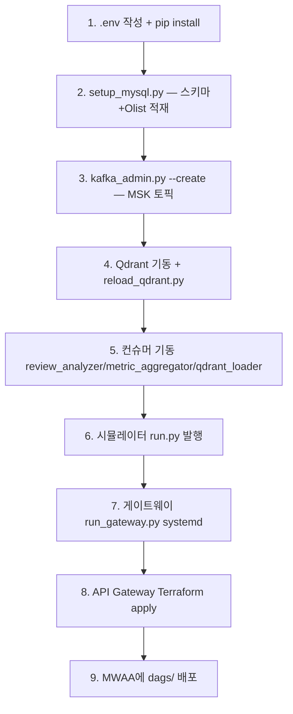

> **상태:** 구현 반영(REALIGNED) — 실제 스택: RDS MySQL · MSK(IAM) · MWAA · RunPod vLLM(Qwen2.5-7B) · Qdrant · AWS API Gateway. 본 문서는 실제 배포 기준으로 재작성됨. 스택 매핑·완성도는 [PROGRESS.md](../PROGRESS.md) 참조.

# 배포 가이드 (실제)

| 항목 | 내용 |
|------|------|
| 문서 버전 | 2.0 (REALIGNED) |
| 작성일 | 2026-05-31 |
| 대상 환경 | EC2(Python/systemd) + AWS 관리형(MSK·RDS·MWAA) + RunPod vLLM + API Gateway |

> **원안과의 차이**: Docker Compose 단일 노드(postgres/redis/kafka/zookeeper/airflow 컨테이너)가 아니라, **EC2의 Python 프로세스 + AWS 관리형 서비스**로 운영한다. Redis는 미도입(Rate Limit은 API Gateway). 상세 매핑은 [PROGRESS.md §9](../PROGRESS.md).

---

## 1. 사전 요구사항

| 항목 | 내용 |
|------|------|
| OS | Ubuntu 22.04 LTS (EC2) |
| Python | 3.10+ (`pip install -r requirements.txt`) |
| 디스크 | 50 GB gp3 (Olist CSV + Qdrant + 로그) |
| RAM | 8 GB+ (fastembed 임베딩 포함) |

외부 자원(모두 사용자 생성):

- **RDS MySQL 8.4** (`commerce_ops`, `olist_raw`) — 시드니(ap-southeast-2)
- **MSK Serverless** (IAM, 9098) — 서울(ap-northeast-2)
- **MWAA** (Airflow) — 서울
- **Qdrant** (셀프호스트, EC2 systemd) — `reviews` 컬렉션
- **RunPod vLLM** — Qwen2.5-7B-Instruct (OpenAI 호환, Cloudflare 뒤)
- **Olist CSV** (Kaggle, [DATA.md](./DATA.md))

---

## 2. 구성 요소 (프로세스/서비스)

| 구성요소 | 위치 | 실행 | 역할 |
|----------|------|------|------|
| FastAPI 게이트웨이 | EC2:8000 | `scripts/run_gateway.py` (systemd) | `/v1/*` 에이전트 API |
| AWS API Gateway (REST) | 관리형 | Terraform `infra/terraform/api-gateway/` | 인증·throttle·TLS, EC2로 프록시 |
| 점포 시뮬레이터 | EC2 | `scripts/run.py` | Olist 샤드 → MSK 발행 |
| Review Analyzer | EC2 | `scripts/review_analyzer.py` | `review_created` → `review_analysis` |
| Metric Aggregator | EC2 | `scripts/metric_aggregator.py` | `review_analyzed` → `daily_category_metrics` |
| Qdrant Loader | EC2 | `scripts/qdrant_loader.py` | `review_created` → 임베딩 |
| Qdrant | EC2 | systemd | 벡터 저장/검색 |
| MWAA DAG | MWAA | `dags/daily_commerce_ops_pipeline.py` | 일별 전체 재계산 + QC |
| RDS MySQL | 관리형(시드니) | — | `olist_raw` + `commerce_ops` |
| MSK | 관리형(서울) | — | 이벤트 스트리밍 |
| vLLM | RunPod | — | LLM 추론 |

> Agent Runtime은 별도 워커가 아니라 **게이트웨이 프로세스 내(`src/agents/`)** 에서 실행된다. Usage Logger 컨슈머는 미구현([TODO.md](../TODO.md)).

---

## 3. 환경 변수

루트 `.env` (템플릿: `.env.example`). 주요 항목:

```bash
# Application
LOG_LEVEL=INFO
SIM_TODAY=2026-05-31

# Gateway — API Gateway 우회 차단용 공유 시크릿 (Terraform origin_secret과 동일)
GATEWAY_ORIGIN_SECRET=

# RDS MySQL (ap-southeast-2)
MYSQL_HOST=...rds.amazonaws.com
MYSQL_PORT=3306
MYSQL_USER=admin
MYSQL_PASSWORD=...
MYSQL_DB_OLIST=olist_raw
MYSQL_DB_OPS=commerce_ops

# MSK (IAM, ap-northeast-2)
AWS_REGION=ap-northeast-2
KAFKA_BOOTSTRAP_SERVERS=...:9098
KAFKA_SECURITY_PROTOCOL=SASL_SSL
KAFKA_ORDER_EVENTS_TOPIC=order_events
KAFKA_REVIEW_CREATED_TOPIC=review_created
KAFKA_REVIEW_ANALYZED_TOPIC=review_analyzed
KAFKA_METRIC_UPDATED_TOPIC=metric_updated

# Qdrant
QDRANT_URL=http://localhost:6333
QDRANT_API_KEY=
QDRANT_COLLECTION=reviews

# vLLM (RunPod)
VLLM_URL=https://....proxy.runpod.net
VLLM_API_KEY=
VLLM_MODEL=Qwen/Qwen2.5-7B-Instruct
```

> 전체·주석은 [`.env.example`](../.env.example). MWAA는 `.env`가 아니라 **Airflow Variable**(`MYSQL_HOST/PORT/USER/PASSWORD`)로 주입.

---

## 4. 기동 순서



### 4.1 명령

```bash
pip install -r requirements.txt
cp .env.example .env            # 값 채우기

python scripts/setup_mysql.py   # RDS 스키마 + Olist 적재
python scripts/kafka_admin.py --create

# 컨슈머 (각 백그라운드/systemd)
python scripts/review_analyzer.py --duration 0
python scripts/metric_aggregator.py --duration 0
python scripts/qdrant_loader.py --duration 0

# 시뮬레이터
python scripts/prepare_edges.py
python scripts/run.py --duration 60

# 게이트웨이
python scripts/run_gateway.py   # 0.0.0.0:8000 (또는 systemd)

# API Gateway
cd infra/terraform/api-gateway && terraform init && terraform apply
```

헬스 확인:

```bash
curl -s http://localhost:8000/health      # {"status":"ok"}
# 인증 엔드포인트
curl -s -H "X-API-Key: <KEY>" http://localhost:8000/v1/models
```

> `/ready`는 미구현 — `/health`만 제공.

---

## 5. Olist 적재 (`scripts/setup_mysql.py`)

| 단계 | 작업 | 검증 |
|------|------|------|
| 1 | CSV를 `data/olist/`(또는 `OLIST_DATA_DIR`)에 배치 | 파일 8개 |
| 2 | `setup_mysql.py` 실행 | `olist_raw` 8테이블 적재(order_items 112,650 등) |
| 3 | `commerce_ops*.sql` 적용 | `review_analysis`/`daily_category_metrics`/`api_keys`(데모키 3) |
| 4 | 컨슈머·시뮬레이터로 집계 | `daily_category_metrics` 채워짐 |

상세: [DATA.md](./DATA.md).

---

## 6. EC2 배포

| 항목 | 권장 |
|------|------|
| 인스턴스 | `t3.xlarge` (4 vCPU, 16 GB) |
| OS | Ubuntu 22.04 |
| 디스크 | 50 GB gp3 |
| 보안 그룹 (인바운드) | 22(SSH), **8000(API Gateway 경유 — `X-Origin-Secret`로 보호)** |
| 아웃바운드 | MSK(9098, 서울) · RDS(3306, 시드니) · RunPod(443) |
| TLS | **API Gateway**가 종단 처리 (Nginx 불필요) |

### 6.1 절차

1. EC2 생성 · `git clone` · `pip install -r requirements.txt` · `.env`
2. Qdrant systemd 기동
3. §4 순서로 적재·컨슈머·게이트웨이(systemd) 기동
4. `infra/terraform/api-gateway` apply (origin_secret = `.env`의 `GATEWAY_ORIGIN_SECRET`)
5. MWAA: `dags/`를 S3에 동기화(`mwaa/finish_mwaa_setup.py`, `mwaa/startup_script.sh`)

### 6.2 운영

| 항목 | 현재 |
|------|------|
| 로그 | loguru → `/workspace/app_logs/{app}/` (`journalctl`로 systemd) |
| 백업 | RDS 자동 스냅샷 |
| 모니터링 | API Gateway → CloudWatch (앱 CloudWatch agent는 TODO) |

> 운영 강화: EC2 8000을 비공개로 두고 **VPC Link + 내부 NLB**(IaC `use_vpc_link=true`)로 전환 권장.

---

## 7. 트러블슈팅

| 증상 | 확인 | 조치 |
|------|------|------|
| `/v1/*` 403 | `X-Origin-Secret` | Terraform `origin_secret` ↔ `.env` `GATEWAY_ORIGIN_SECRET` 일치 |
| 401 | API Key | `commerce_ops.api_keys`에 해당 키 해시 존재? |
| vLLM error 1010 | RunPod/Cloudflare | `common/llm.py` UA 강제 확인, `VLLM_URL` |
| API Gateway 504 | 통합 타임아웃 | 에이전트 지연 > 29s — 쿼터 상향 또는 질의 단순화 |
| MySQL 연결 실패 | SG/교차리전 | RDS SG에 EC2 IP 허용, `MYSQL_HOST` |
| MSK 연결 실패 | IAM | `KAFKA_SECURITY_PROTOCOL=SASL_SSL`, IAM 권한, `AWS_REGION` |
| SQL_REJECTED | 가드레일 | [AGENTS.md](./AGENTS.md) 화이트리스트/블랙리스트 |
| Kafka lag 증가 | consumer | 컨슈머 인스턴스 추가(수평 확장) |

---

## 8. 관련 문서

- [ARCHITECTURE.md](./ARCHITECTURE.md) · [DATA.md](./DATA.md) · [LOAD_TEST.md](./LOAD_TEST.md)
- IaC: `infra/terraform/api-gateway/README.md` · 남은 작업: [TODO.md](../TODO.md)

---

## 9. 변경 이력

| 버전 | 날짜 | 변경 |
|------|------|------|
| 1.0 | 2026-05-31 | Docker Compose 사전 설계 초안 |
| 2.0 | 2026-05-31 | **REALIGNED** — EC2(systemd) + 관리형(MSK/RDS/MWAA) + RunPod vLLM + API Gateway 실제 배포로 재작성 |
