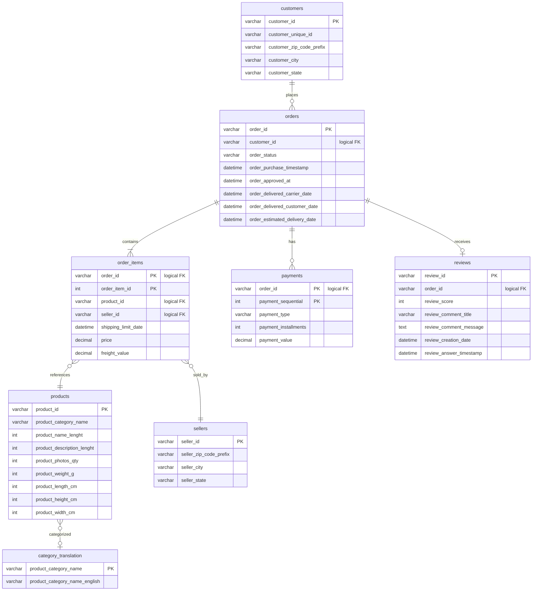
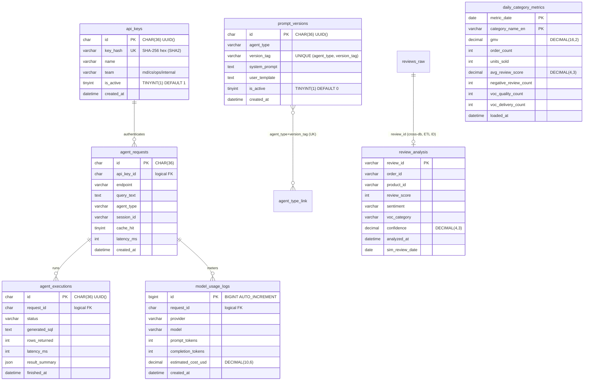

> **상태:** 구현 반영(REALIGNED) — 실제 스택: RDS MySQL · MSK(IAM) · MWAA · RunPod vLLM(Qwen2.5-7B) · Qdrant · AWS API Gateway. 본 문서의 PostgreSQL/Redis/Docker Compose/OpenAI·Claude 언급은 구현과 다름 — 스택 매핑·완성도는 [PROGRESS.md](../PROGRESS.md) 참조.

# 논리 ERD (Entity Relationship Diagram)

| 항목 | 내용 |
|------|------|
| 문서 버전 | 2.0 |
| 작성일 | 2026-05-31 |
| DB | **RDS MySQL 8.4** — `olist_raw` + `commerce_ops` (단일 인스턴스, InnoDB / utf8mb4) |
| DDL 위치 | `db/schema/mysql/olist_raw.sql`, `db/schema/mysql/commerce_ops.sql`, `db/schema/mysql/commerce_ops_agent.sql` |
| 관련 | [DATA.md](./DATA.md), [TODO.md](../TODO.md), [PROGRESS.md](../PROGRESS.md) |

> 본 문서는 **논리 모델·인덱스·관계 의도**를 기술하되, 타입·제약은 위 MySQL DDL을 Source of Truth로 따른다. `olist_raw`는 대량 적재 단순화를 위해 **물리 FK를 생략**하고 인덱스만 유지한다(관계는 논리적). Cross-DB FK도 사용하지 않는다.

---

## 1. 데이터베이스 분리

| 데이터베이스 | 스키마 목적 | 정의 파일 |
|------------|-------------|-----------|
| `olist_raw` | Olist Brazilian E-Commerce 원본 8 테이블 | `olist_raw.sql` |
| `commerce_ops` | 분석 결과·일별 집계 | `commerce_ops.sql` |
| `commerce_ops` | 인증·로깅·프롬프트(Gateway/Agent) | `commerce_ops_agent.sql` |

Agent·Airflow는 ETL/조회로 `olist_raw` 데이터를 참조한다(Cross-DB FK 없음).

---

## 2. Olist 원본 (`olist_raw`)

### 2.1 Mermaid ER Diagram

> 관계는 논리적(물리 FK 미생성). 타입은 MySQL 기준: 식별자 `VARCHAR`, 타임스탬프 `DATETIME`, 금액 `DECIMAL`.



### 2.2 테이블 요약 (`olist_raw.sql`)

| 테이블 | PK | 논리 FK | 비고 |
|--------|-----|---------|------|
| `customers` | `customer_id` VARCHAR(64) | — | |
| `orders` | `order_id` VARCHAR(64) | `customer_id` | 상태·배송 `DATETIME` |
| `order_items` | `(order_id, order_item_id)` | `order_id`, `product_id`, `seller_id` | 복합 PK |
| `products` | `product_id` VARCHAR(64) | — | 카테고리명 포르투갈어, 컬럼명 `lenght`는 원본 오타 유지 |
| `reviews` | `review_id` VARCHAR(64) | `order_id` | 1 order : 0..1 review (`review_id` dedup 적재) |
| `payments` | `(order_id, payment_sequential)` | `order_id` | 결제 수단·할부 |
| `sellers` | `seller_id` VARCHAR(64) | — | |
| `category_translation` | `product_category_name` VARCHAR(128) | — | 영문 매핑 |

### 2.3 인덱스 (`olist_raw.sql`, 실제)

| 테이블 | 인덱스 | 용도 |
|--------|--------|------|
| `orders` | `idx_orders_customer (customer_id)`, `idx_orders_purchase (order_purchase_timestamp)` | 고객·기간 필터 |
| `order_items` | `idx_oi_product (product_id)`, `idx_oi_seller (seller_id)` | 상품·판매자 분석 |
| `reviews` | `idx_reviews_order (order_id)`, `idx_reviews_score (review_score)` | VOC·점수 집계 |
| `products` | `idx_products_category (product_category_name)` | 카테고리 조인 |

> 모든 테이블 `ENGINE=InnoDB`, DB charset `utf8mb4`. `payments`는 추가 인덱스 없이 복합 PK만 둔다.

---

## 3. 운영·분석·인증 (`commerce_ops`)

분석·집계 테이블은 `commerce_ops.sql`, 인증·로깅·프롬프트 테이블은 `commerce_ops_agent.sql` 에 정의된다. MySQL 타입 요점: UUID → `CHAR(36) DEFAULT (UUID())`, boolean → `TINYINT(1)`, JSON → `JSON`, bigserial → `BIGINT AUTO_INCREMENT`, timestamptz → `DATETIME DEFAULT CURRENT_TIMESTAMP`.

### 3.1 Mermaid ER Diagram



> **미구현/계획:** 초기 설계의 시뮬레이션 엔티티 `orders_sim` / `reviews_sim` 및 대응 **VIEW**(`v_orders_sim` / `v_reviews_sim`)는 **생성하지 않았다**. 시뮬레이션 달력은 `review_analysis.sim_review_date` 컬럼으로 구현한다 — [DATA.md §4](./DATA.md). 추가 시프트 컬럼/뷰는 [TODO.md](../TODO.md).
>
> 물리 FK는 두지 않으므로 위 관계는 논리적이다. `agent_executions`–`prompt_versions` 연결은 컬럼이 아닌 `prompt_versions(agent_type, version_tag)` UK로 식별한다(`agent_executions`에 `prompt_version_id` 컬럼 미존재). `review_analysis`는 `commerce_ops`에, 원본 `reviews`는 `olist_raw`에 있어 Cross-DB이며 `review_id`로만 논리 연결한다.

### 3.2 테이블 정의 (MySQL, 실제 DDL)

#### `api_keys` (`commerce_ops_agent.sql`)

| 컬럼 | 타입 | 제약 | 설명 |
|------|------|------|------|
| `id` | `CHAR(36)` | PK, `DEFAULT (UUID())` | |
| `key_hash` | `VARCHAR(64)` | UNIQUE, NOT NULL | SHA-256 hex (`SHA2(...,256)`), 평문 저장 금지 |
| `name` | `VARCHAR(128)` | | 팀·앱 이름 |
| `team` | `VARCHAR(32)` | | md / cs / ops / internal |
| `is_active` | `TINYINT(1)` | NOT NULL DEFAULT 1 | boolean |
| `created_at` | `DATETIME` | DEFAULT CURRENT_TIMESTAMP | |

> 데모 키 3건을 `INSERT IGNORE ... SHA2('oy_demo_*', 256)` 로 멱등 시드.

#### `prompt_versions` (`commerce_ops_agent.sql`)

| 컬럼 | 타입 | 제약 |
|------|------|------|
| `id` | `CHAR(36)` | PK, `DEFAULT (UUID())` |
| `agent_type` | `VARCHAR(32)` | NOT NULL |
| `version_tag` | `VARCHAR(32)` | NOT NULL, `UNIQUE KEY uq_pv (agent_type, version_tag)` |
| `system_prompt` | `TEXT` | |
| `user_template` | `TEXT` | `{query}`, `{schema}` 플레이스홀더 |
| `is_active` | `TINYINT(1)` | NOT NULL DEFAULT 0 |
| `created_at` | `DATETIME` | DEFAULT CURRENT_TIMESTAMP |

#### `agent_requests` (`commerce_ops_agent.sql`)

Gateway 수신 단위. 캐시 hit·지연 포함.

| 컬럼 | 타입 | 제약 |
|------|------|------|
| `id` | `CHAR(36)` | PK |
| `api_key_id` | `CHAR(36)` | 논리 FK → `api_keys(id)` |
| `endpoint` | `VARCHAR(64)` | `/v1/chat` 등 |
| `query_text` | `TEXT` | 원문 |
| `agent_type` | `VARCHAR(32)` | md / voc / insight / auto |
| `session_id` | `VARCHAR(64)` | nullable |
| `cache_hit` | `TINYINT(1)` | |
| `latency_ms` | `INT` | |
| `created_at` | `DATETIME` | DEFAULT CURRENT_TIMESTAMP |

**인덱스:** `idx_req_created (created_at)`, `idx_req_key (api_key_id)`

#### `agent_executions` (`commerce_ops_agent.sql`)

| 컬럼 | 타입 | 제약 |
|------|------|------|
| `id` | `CHAR(36)` | PK, `DEFAULT (UUID())` |
| `request_id` | `CHAR(36)` | 논리 FK → `agent_requests(id)` |
| `status` | `VARCHAR(16)` | success / failed / sql_rejected |
| `generated_sql` | `TEXT` | nullable |
| `rows_returned` | `INT` | |
| `latency_ms` | `INT` | |
| `result_summary` | `JSON` | 요약 메타 |
| `finished_at` | `DATETIME` | DEFAULT CURRENT_TIMESTAMP |

**인덱스:** `idx_exec_req (request_id)`

#### `model_usage_logs` (`commerce_ops_agent.sql`)

| 컬럼 | 타입 | 제약 |
|------|------|------|
| `id` | `BIGINT` | PK, AUTO_INCREMENT |
| `request_id` | `CHAR(36)` | 논리 FK → `agent_requests(id)` |
| `provider` | `VARCHAR(32)` | runpod / vllm 등 |
| `model` | `VARCHAR(64)` | 예: Qwen2.5-7B |
| `prompt_tokens` | `INT` | |
| `completion_tokens` | `INT` | |
| `estimated_cost_usd` | `DECIMAL(10,6)` | |
| `created_at` | `DATETIME` | DEFAULT CURRENT_TIMESTAMP |

**인덱스:** `idx_usage_created (created_at)`

#### `review_analysis` (`commerce_ops.sql`)

Kafka Review Analyzer 출력. PK `review_id` 로 멱등 UPSERT(`ON DUPLICATE KEY UPDATE`).

| 컬럼 | 타입 | 제약 |
|------|------|------|
| `review_id` | `VARCHAR(64)` | PK |
| `order_id` | `VARCHAR(64)` | |
| `product_id` | `VARCHAR(64)` | ETL 시 `order_items` 조인으로 채움 |
| `review_score` | `INT` | |
| `sentiment` | `VARCHAR(16)` | positive / neutral / negative |
| `voc_category` | `VARCHAR(16)` | quality / delivery / price / service / other |
| `confidence` | `DECIMAL(4,3)` | |
| `analyzed_at` | `DATETIME` | DEFAULT CURRENT_TIMESTAMP |
| `sim_review_date` | `DATE` | 시뮬레이션 달력 — [DATA.md](./DATA.md) |

**인덱스:** `idx_ra_date (sim_review_date)`, `idx_ra_voc (voc_category, sentiment)`, `idx_ra_order (order_id)`

#### `daily_category_metrics` (`commerce_ops.sql`)

Airflow 적재 대상. Agent Insight/MD의 **사전 집계** 소스.

| 컬럼 | 타입 | 제약 |
|------|------|------|
| `metric_date` | `DATE` | PK (복합) |
| `category_name_en` | `VARCHAR(128)` | PK (복합) |
| `gmv` | `DECIMAL(16,2)` | |
| `order_count` | `INT` | |
| `units_sold` | `INT` | |
| `avg_review_score` | `DECIMAL(4,3)` | |
| `negative_review_count` | `INT` | |
| `voc_quality_count` | `INT` | |
| `voc_delivery_count` | `INT` | |
| `loaded_at` | `DATETIME` | DEFAULT CURRENT_TIMESTAMP |

**인덱스:** `idx_dcm_date (metric_date)`

---

## 4. 관계 요약 (논리)

### 4.1 `olist_raw` (Olist)

```
customers (1) ──< orders (N)
orders (1) ──< order_items (N)
orders (1) ──< payments (N)
orders (1) ──o reviews (0..1)
products (1) ──< order_items (N)
sellers (1) ──< order_items (N)
category_translation (1) ──o products (N)  [product_category_name]
```

### 4.2 `commerce_ops`

```
api_keys (1) ──< agent_requests (N)
agent_requests (1) ──< agent_executions (N)
agent_requests (1) ──< model_usage_logs (N)
prompt_versions: (agent_type, version_tag) UNIQUE  [실행 시 태그로 참조]
[olist_raw.reviews] — review_id 논리 연결 → commerce_ops.review_analysis (Cross-DB ETL ID)
```

> 물리 FK 미생성: 무결성은 적재 순서·애플리케이션 레벨에서 보장한다.

---

## 5. DDL 디렉터리 구조 (실제)

```text
db/schema/mysql/
├── olist_raw.sql            # 8 테이블 + 인덱스 (CREATE DATABASE/USE 포함)
├── commerce_ops.sql         # review_analysis, daily_category_metrics
└── commerce_ops_agent.sql   # api_keys, prompt_versions, agent_requests,
                             # agent_executions, model_usage_logs + 데모 키 시드

scripts/setup_mysql.py       # 스키마 적용(olist_raw + commerce_ops) + Olist CSV 적재
```

> 마이그레이션 도구(Flyway/Alembic)는 미도입 — 순번 없는 단일 SQL + `setup_mysql.py` 로 적용한다. `commerce_ops_agent.sql`은 Gateway/Agent 단계에서 별도 적용. 잔여 항목은 [TODO.md](../TODO.md) 참조.

---

## 6. 변경 이력

| 버전 | 날짜 | 변경 |
|------|------|------|
| 1.0 | 2026-05-31 | 논리 ERD 초안 (PostgreSQL 기준) |
| 2.0 | 2026-05-31 | REALIGNED — MySQL/실제 스키마 반영 |
