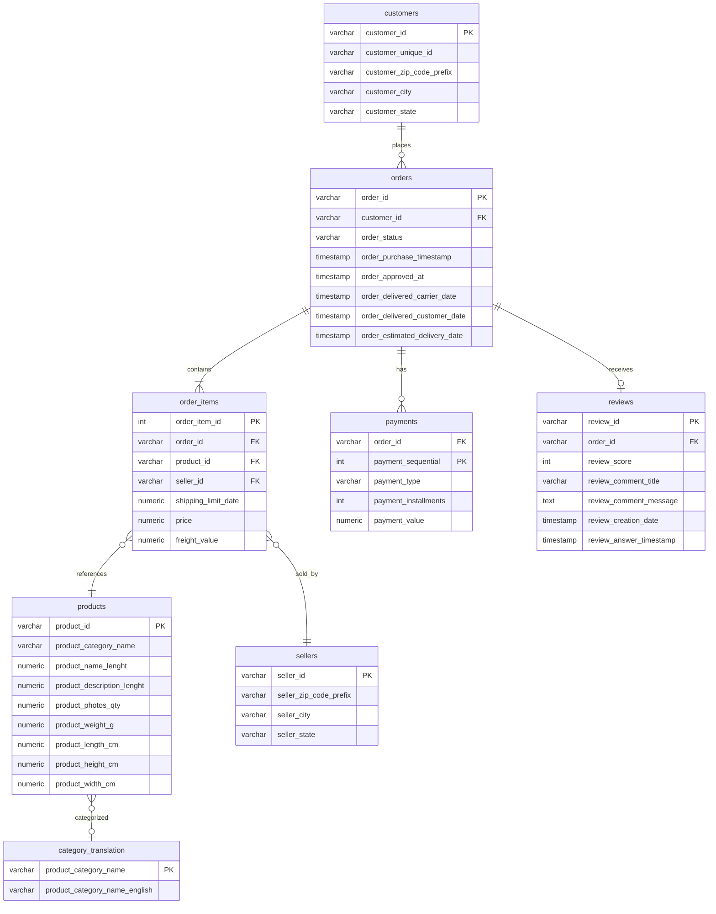

> **상태:** 구현 반영(REALIGNED) — 실제 스택: RDS MySQL · MSK(IAM) · MWAA · RunPod vLLM(Qwen2.5-7B) · Qdrant · AWS API Gateway. 본 문서의 PostgreSQL/Redis/Docker Compose/OpenAI·Claude 언급은 구현과 다름 — 스택 매핑·완성도는 [PROGRESS.md](../PROGRESS.md) 참조.

# 논리 ERD (Entity Relationship Diagram)

| 항목 | 내용 |
|------|------|
| 문서 버전 | 1.0 |
| 작성일 | 2026-05-31 |
| DDL 위치 (예정) | `db/schema/olist_raw/`, `db/schema/commerce_ops/` |

> 물리 DDL·마이그레이션은 구현 단계에서 `db/schema/`에 생성한다. 본 문서는 **논리 모델·인덱스·FK 의도**를 정의한다.

---

## 1. 데이터베이스 분리

| 데이터베이스 | 스키마 목적 |
|------------|-------------|
| `olist_raw` | Olist Brazilian E-Commerce 원본 테이블 |
| `commerce_ops` | Agent 운영, 분석 결과, API 키, 일별 집계 |

Cross-DB FK는 사용하지 않는다. Agent·Airflow는 `commerce_ops` 내 뷰 또는 ETL로 `olist_raw` 데이터를 참조한다.

---

## 2. Olist 원본 (`olist_raw`)

### 2.1 Mermaid ER Diagram



### 2.2 테이블 요약

| 테이블 | PK | 주요 FK | 비고 |
|--------|-----|---------|------|
| `customers` | `customer_id` | — | |
| `orders` | `order_id` | `customer_id` | 상태·배송 타임스탬프 |
| `order_items` | `(order_id, order_item_id)` | `order_id`, `product_id`, `seller_id` | Olist는 복합 PK 관례 |
| `products` | `product_id` | — | 카테고리명은 포르투갈어 |
| `reviews` | `review_id` | `order_id` | 1 order : 0..1 review |
| `payments` | `(order_id, payment_sequential)` | `order_id` | 결제 수단·할부 |
| `sellers` | `seller_id` | — | |
| `category_translation` | `product_category_name` | — | 영문 카테고리 매핑 |

### 2.3 권장 인덱스 (`olist_raw`)

| 테이블 | 인덱스 | 용도 |
|--------|--------|------|
| `orders` | `(customer_id)`, `(order_purchase_timestamp)` | 고객·기간 필터 |
| `order_items` | `(product_id)`, `(seller_id)` | 상품·판매자 분석 |
| `reviews` | `(order_id)`, `(review_creation_date)`, `(review_score)` | VOC·기간 집계 |
| `payments` | `(order_id)` | 주문별 결제 |
| `products` | `(product_category_name)` | 카테고리 조인 |

> **TODO (구현 후):** Olist CSV 컬럼명·NULL 비율에 맞춰 DDL 타입 미세 조정.

---

## 3. 운영·분석 (`commerce_ops`)

### 3.1 Mermaid ER Diagram

```mermaid
erDiagram
    api_keys ||--o{ agent_requests : authenticates
    agent_requests ||--o{ agent_executions : runs
    prompt_versions ||--o{ agent_executions : uses
    orders_sim ||--o{ reviews_sim : optional_link
    reviews_sim ||--o| review_analysis : analyzed
    daily_category_metrics }o--|| category_dim : aggregates

    api_keys {
        uuid id PK
        varchar key_hash UK
        varchar name
        varchar team
        boolean is_active
        timestamptz created_at
    }

    agent_requests {
        uuid id PK
        uuid api_key_id FK
        varchar endpoint
        text query_text
        varchar agent_type
        varchar session_id
        varchar cache_hit
        timestamptz created_at
    }

    agent_executions {
        uuid id PK
        uuid request_id FK
        uuid prompt_version_id FK
        varchar status
        text generated_sql
        int rows_returned
        int latency_ms
        jsonb result_summary
        timestamptz finished_at
    }

    prompt_versions {
        uuid id PK
        varchar agent_type
        varchar version_tag UK
        text system_prompt
        text user_template
        boolean is_active
        timestamptz created_at
    }

    model_usage_logs {
        bigserial id PK
        uuid request_id FK
        varchar provider
        varchar model
        int prompt_tokens
        int completion_tokens
        numeric estimated_cost_usd
        timestamptz created_at
    }

    review_analysis {
        varchar review_id PK
        varchar order_id
        varchar product_id
        int review_score
        varchar sentiment
        varchar voc_category
        numeric confidence
        timestamptz analyzed_at
        date sim_review_date
    }

    daily_category_metrics {
        date metric_date PK
        varchar category_name_en PK
        numeric gmv
        int order_count
        int units_sold
        numeric avg_review_score
        int negative_review_count
        int voc_quality_count
        int voc_delivery_count
        timestamptz loaded_at
    }
```



> `orders_sim` / `reviews_sim`는 시뮬레이션용 논리 엔티티로, 구현 시 `reviews`에 `sim_*` 컬럼을 추가하거나 별도 스테이징 테이블로 대체할 수 있다. [DATA.md](./DATA.md) 참조.

### 3.2 테이블 정의

#### `api_keys`

| 컬럼 | 타입 | 제약 | 설명 |
|------|------|------|------|
| `id` | UUID | PK | |
| `key_hash` | VARCHAR | UNIQUE, NOT NULL | 평문 키 저장 금지 (bcrypt/SHA256) |
| `name` | VARCHAR | | 팀·앱 이름 |
| `team` | VARCHAR | | MD / CS / ops / internal |
| `is_active` | BOOLEAN | DEFAULT true | |
| `created_at` | TIMESTAMPTZ | | |

#### `agent_requests`

Gateway 수신 단위. 캐시 hit 여부 포함.

| 컬럼 | 타입 | 제약 |
|------|------|------|
| `id` | UUID | PK |
| `api_key_id` | UUID | FK → `api_keys(id)` ON DELETE SET NULL |
| `endpoint` | VARCHAR | `/v1/chat` 등 |
| `query_text` | TEXT | 정규화 전 원문 |
| `agent_type` | VARCHAR | `md` / `voc` / `insight` / `auto` |
| `session_id` | VARCHAR | nullable |
| `cache_hit` | BOOLEAN | |
| `created_at` | TIMESTAMPTZ | |

**인덱스:** `(api_key_id, created_at DESC)`, `(session_id)`, `(created_at)` — 사용량 API

#### `agent_executions`

| 컬럼 | 타입 | 제약 |
|------|------|------|
| `id` | UUID | PK |
| `request_id` | UUID | FK → `agent_requests(id)` |
| `prompt_version_id` | UUID | FK → `prompt_versions(id)` |
| `status` | VARCHAR | `success` / `failed` / `sql_rejected` |
| `generated_sql` | TEXT | nullable |
| `rows_returned` | INT | |
| `latency_ms` | INT | |
| `result_summary` | JSONB | 요약 메타 |
| `finished_at` | TIMESTAMPTZ | |

**인덱스:** `(request_id)`, `(status, finished_at)`

#### `prompt_versions`

| 컬럼 | 타입 | 제약 |
|------|------|------|
| `id` | UUID | PK |
| `agent_type` | VARCHAR | |
| `version_tag` | VARCHAR | UNIQUE per agent_type |
| `system_prompt` | TEXT | |
| `user_template` | TEXT | `{query}`, `{schema}` 플레이스홀더 |
| `is_active` | BOOLEAN | agent_type당 하나만 true 권장 |
| `created_at` | TIMESTAMPTZ | |

**인덱스:** `(agent_type, is_active)` WHERE is_active = true

#### `model_usage_logs`

| 컬럼 | 타입 | 제약 |
|------|------|------|
| `id` | BIGSERIAL | PK |
| `request_id` | UUID | FK → `agent_requests(id)` |
| `provider` | VARCHAR | openai / anthropic |
| `model` | VARCHAR | |
| `prompt_tokens` | INT | |
| `completion_tokens` | INT | |
| `estimated_cost_usd` | NUMERIC(10,6) | |
| `created_at` | TIMESTAMPTZ | |

**인덱스:** `(created_at)`, `(provider, model, created_at)`

#### `review_analysis`

Kafka Review Analyzer 출력.

| 컬럼 | 타입 | 제약 |
|------|------|------|
| `review_id` | VARCHAR | PK |
| `order_id` | VARCHAR | |
| `product_id` | VARCHAR | ETL 시 order_items 조인으로 채움 |
| `review_score` | INT | |
| `sentiment` | VARCHAR | positive / neutral / negative |
| `voc_category` | VARCHAR | quality / delivery / price / service / other |
| `confidence` | NUMERIC(4,3) | |
| `analyzed_at` | TIMESTAMPTZ | |
| `sim_review_date` | DATE | 시뮬레이션 달력 — [DATA.md](./DATA.md) |

**인덱스:** `(product_id, sim_review_date)`, `(voc_category, sentiment)`, `(sim_review_date)`

#### `daily_category_metrics`

Airflow `load_daily_metrics` 적재 대상. Agent Insight/MD의 **사전 집계** 소스.

| 컬럼 | 타입 | 제약 |
|------|------|------|
| `metric_date` | DATE | PK (복합) |
| `category_name_en` | VARCHAR | PK (복합) |
| `gmv` | NUMERIC | |
| `order_count` | INT | |
| `units_sold` | INT | |
| `avg_review_score` | NUMERIC | |
| `negative_review_count` | INT | |
| `voc_quality_count` | INT | |
| `voc_delivery_count` | INT | |
| `loaded_at` | TIMESTAMPTZ | |

**인덱스:** `(metric_date DESC)`, `(category_name_en, metric_date)`

---

## 4. FK 관계 요약

### 4.1 `olist_raw` (Olist)

```
customers (1) ──< orders (N)
orders (1) ──< order_items (N)
orders (1) ──< payments (N)
orders (1) ──o reviews (0..1)
products (1) ──< order_items (N)
sellers (1) ──< order_items (N)
category_translation (1) ──o products (N)  [product_category_name]
```

### 4.2 `commerce_ops`

```
api_keys (1) ──< agent_requests (N)
agent_requests (1) ──< agent_executions (N)
agent_requests (1) ──< model_usage_logs (N)
prompt_versions (1) ──< agent_executions (N)
[reviews / review_analysis] — review_id 논리 연결 (cross-db는 ETL ID만)
```

---

## 5. DDL 디렉터리 구조 (예정)

```text
db/schema/
├── olist_raw/
│   ├── 001_customers.sql
│   ├── 002_orders.sql
│   └── ...
└── commerce_ops/
    ├── 001_api_keys.sql
    ├── 002_agent_requests.sql
    └── ...
db/seed/
├── olist/          # CSV bulk load
└── commerce_ops/   # prompt_versions, api_keys 샘플
```

> **TODO (구현):** Flyway/Alembic vs 순번 SQL 선택 후 본 문서 §5 갱신.

---

## 6. 변경 이력

| 버전 | 날짜 | 변경 |
|------|------|------|
| 1.0 | 2026-05-31 | 논리 ERD 초안 |
