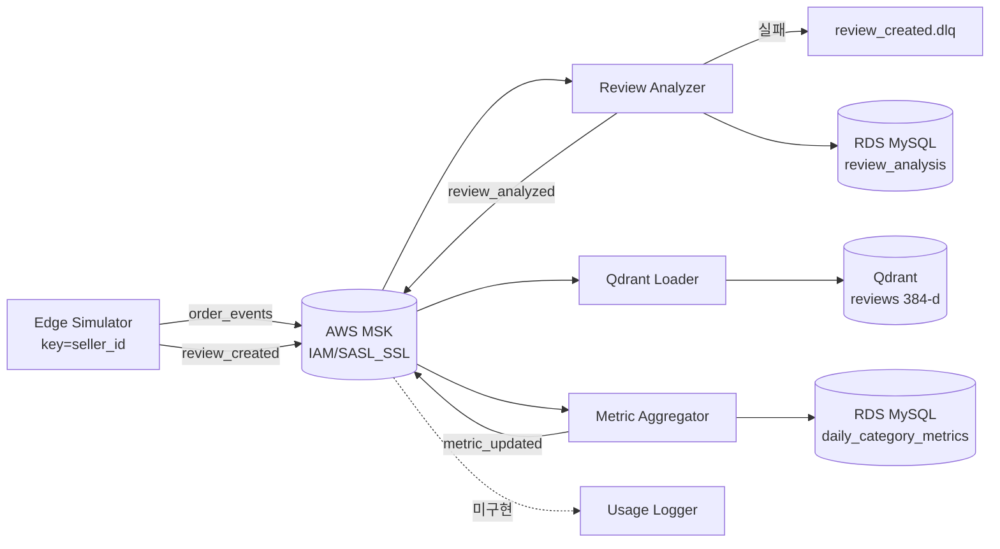

> **상태:** 구현 반영(REALIGNED) — 실제 스택: RDS MySQL · MSK(IAM) · MWAA · RunPod vLLM(Qwen2.5-7B) · Qdrant · AWS API Gateway. 본 문서의 PostgreSQL/Redis/Docker Compose/OpenAI·Claude 언급은 구현과 다름 — 스택 매핑·완성도는 [PROGRESS.md](../PROGRESS.md) 참조.

# Kafka 이벤트 파이프라인 (AWS MSK)

| 항목 | 내용 |
|------|------|
| 문서 버전 | 2.0 |
| 작성일 | 2026-05-31 |
| 브로커 | **AWS MSK Serverless** (ap-northeast-2 서울), IAM 인증 |
| 클라이언트 | `aiokafka` (Producer / Consumer / Admin), MSK IAM SASL 서명자 |

> 초안(v1)은 Docker Compose 단일 브로커 · ZooKeeper · `:9092` PLAINTEXT를 가정했으나, 실제 구현은 **AWS MSK Serverless + IAM(SASL_SSL/OAUTHBEARER, `:9098`)** 이다. 본 문서는 코드(`src/edge_simulator/*`, `src/consumers/*`, `scripts/kafka_admin.py`)에 맞춰 재작성됐다. 남은 갭은 [TODO.md](../TODO.md) 참조.

---

## 1. 토픽 목록

토픽은 `scripts/kafka_admin.py --create` 가 `src/edge_simulator/admin.py`를 통해 명시적으로 생성한다(자동 생성 비의존). 파티션·보관·압축 설정은 `KafkaConfig.topic_specs`(`src/edge_simulator/config.py`)가 단일 출처(SSOT)다.

| Topic | 파티션 | 정책 | 설명 |
|-------|--------|------|------|
| `order_events` | 12 | `retention.ms=7d` | 주문 이벤트(최고 볼륨 → 파티션 최다) |
| `review_created` | 6 | `retention.ms=7d` | 신규·시뮬레이션 리뷰 생성 |
| `review_analyzed` | 6 | `retention.ms=7d` | 감성·VOC 분석 완료 |
| `metric_updated` | 3 | `cleanup.policy=compact` | 집계 스냅샷 갱신(키별 최신 상태 → 로그 컴팩션) |
| `review_created.dlq` | 3 | `retention.ms=14d` | 리뷰 분석 실패(poison) 격리 |
| `order_events.dlq` | 3 | `retention.ms=14d` | 주문 처리 실패 격리(컨슈머 단계 예약) |

- **파티션 = 병렬성·순서 단위** (컨슈머 수 ≤ 파티션). `order_events`가 최고 볼륨이라 12로 가장 많다.
- **복제 계수(RF):** MSK는 RF=3 필수(`KAFKA_REPLICATION` 미설정 시 SASL_SSL이면 3, 로컬 PLAINTEXT면 1). `admin.create_topics`는 MSK가 특정 `topic_configs`를 거부하면 config 없이 자동 재시도한다.
- 토픽명은 모두 환경변수로 오버라이드 가능(아래 §6).

---

## 2. 메시지 스키마 (JSON)

모든 메시지 공통 봉투:

```json
{
  "event_id": "uuid",
  "event_type": "review_created",
  "occurred_at": "2026-05-31T12:00:00Z",
  "payload": { }
}
```

`event_id`는 멱등 처리 키로 사용. 컨슈머가 재발행하는 이벤트(`review_analyzed`, `metric_updated`)의 `event_id`는 결정적 `uuid5`(네임스페이스 + 자연키)로 도출되어 재처리 시에도 동일하다.

---

### 2.1 `review_created`

**Producer:** Edge Simulator (`src/edge_simulator/producer.py`) — 점포별 타임라인을 재생, **`key=seller_id`** 로 발행(seller 단위 파티션 지역성·순서 보장)

**Consumer:** Review Analyzer (`consumer_group=review-analyzer-v1`), Qdrant Loader (`consumer_group=qdrant-loader-v1`) — 동일 토픽을 서로 다른 그룹으로 병행 소비

```json
{
  "event_id": "7c9e6679-7425-40de-944b-e07fc1f90ae7",
  "event_type": "review_created",
  "occurred_at": "2026-05-31T12:00:00Z",
  "payload": {
    "review_id": "rp7eac94d1e77b9c7c4f8a80b65218a1",
    "order_id": "e481f90c4c5c6a1d8b1e2f3a4b5c6d7e",
    "review_score": 2,
    "review_comment_title": "Atraso na entrega",
    "review_comment_message": "Produto chegou com atraso...",
    "sim_review_date": "2026-05-31",
    "source": "simulator"
  }
}
```

| 필드 | 타입 | 필수 |
|------|------|------|
| `review_id` | string | Y |
| `order_id` | string | Y |
| `review_score` | int 1-5 | Y |
| `review_comment_title` | string | N |
| `review_comment_message` | string | N |
| `sim_review_date` | date string | Y |
| `source` | string | `simulator` / `seed` / `api` |

> `order_events`는 Edge Simulator가 동일 봉투·`key=seller_id`로 발행하는 주문 이벤트 토픽이다. 현재 전용 컨슈머는 **미구현**(`order_events.dlq`도 예약만).

---

### 2.2 `review_analyzed`

**Producer:** Review Analyzer

**Consumer:** Metric Aggregator (`consumer_group=metric-aggregator-v1`)

```json
{
  "event_id": "a1b2c3d4-e5f6-7890-abcd-ef1234567890",
  "event_type": "review_analyzed",
  "occurred_at": "2026-05-31T12:00:02Z",
  "payload": {
    "review_id": "rp7eac94d1e77b9c7c4f8a80b65218a1",
    "order_id": "e481f90c4c5c6a1d8b1e2f3a4b5c6d7e",
    "product_id": "5cf42900-9b2b-4f3a-8c1d-2e3f4a5b6c7d",
    "sentiment": "negative",
    "voc_category": "delivery",
    "confidence": 0.91,
    "sim_review_date": "2026-05-31"
  }
}
```

DB 동기: **RDS MySQL** `commerce_ops.review_analysis` 를 `review_id` 기준 멱등 UPSERT (`INSERT … ON DUPLICATE KEY UPDATE`, `pymysql.executemany`로 교차리전 RTT 절감). 발행 시 `key=review_id`.

---

### 2.3 `metric_updated`

**Producer:** Metric Aggregator, (선택) Airflow `load_daily_metrics` **미구현**

**Consumer:** Usage Logger (`consumer_group=usage-logger-v1`) — **미구현**. 모델 사용량은 Gateway가 RDS에 직접 기록(이 토픽은 감사용 예약).

```json
{
  "event_id": "b2c3d4e5-f6a7-8901-bcde-f12345678901",
  "event_type": "metric_updated",
  "occurred_at": "2026-05-31T12:00:05Z",
  "payload": {
    "metric_date": "2026-05-31",
    "category_name_en": "health_beauty",
    "gmv": 125000.50,
    "negative_review_count": 42,
    "aggregation_scope": "category_daily"
  }
}
```

`metric_updated`는 컴팩션 토픽이라 `key=metric_date|category` 로 발행하여 (날짜·카테고리)별 최신 스냅샷만 유지한다. Aggregator는 값(gmv·negative_count)이 직전과 같으면 재발행을 생략(과다발행 방지).

---

## 3. Producer / Consumer 매핑



| 컴포넌트 | Role | Topics In | Topics Out | DB/저장소 |
|----------|------|-----------|------------|-----------|
| `edge-simulator` | Producer | — | `order_events`, `review_created` | — |
| `review-analyzer` | Consumer/Producer | `review_created` | `review_analyzed` (실패 → `review_created.dlq`) | RDS `review_analysis` |
| `qdrant-loader` | Consumer | `review_created` | — | Qdrant `reviews` |
| `metric-aggregator` | Consumer/Producer | `review_analyzed` | `metric_updated` | RDS `daily_category_metrics` |
| `usage-logger` **(미구현)** | Consumer | `metric_updated` | — | RDS `model_usage_logs` |
| Gateway | — | — | — (HTTP만) | RDS 직접 기록 |

분류 엔진(`src/consumers/analysis.py`): 기본 **휴리스틱**(평점 + 포르투갈어 키워드), `--analyzer llm` 지정 시 **RunPod vLLM(Qwen, OpenAI 호환)** 호출 후 실패 시 휴리스틱 폴백.

---

## 4. Consumer Groups

| Group ID | Service | 구현 | Offset reset |
|----------|---------|------|--------------|
| `review-analyzer-v1` | review-analyzer | O | earliest |
| `qdrant-loader-v1` | qdrant-loader | O | earliest |
| `metric-aggregator-v1` | metric-aggregator | O | earliest |
| `usage-logger-v1` | usage-logger | **미구현** | latest |

- 모든 컨슈머는 `enable_auto_commit=True` + `getmany(...)` 배치 처리, **at-least-once**.
- 동시성: MSK 측 파티션 수(§1) 한도 내에서 컨슈머 인스턴스를 늘려 확장.
- **재처리 멱등성:** `review_analysis`는 `review_id` UPSERT, `daily_category_metrics`는 영향받은 날짜를 서버사이드 1쿼리로 전체 재계산, Qdrant는 `uuid5(review_id)` point id upsert — 모두 재실행해도 결과 동일.
- **DLQ:** Review Analyzer는 봉투 파싱/분석 실패 시 원본 메시지를 `review_created.dlq`로 그대로 전달(key 보존)한다. 자동 재시도 횟수 기반 라우팅·DLQ 소비자는 **미구현**([TODO.md](../TODO.md)).

---

## 5. Replay 시나리오 (부하 테스트 · 시나리오 4)

### 5.1 목적

- Review Analyzer·MySQL 쓰기 처리량과 컨슈머 lag 측정
- 시뮬레이터로 이벤트 발행(HTTP 부하와 별도)

### 5.2 절차

1. 토픽 존재 확인/생성: `python scripts/kafka_admin.py --list` / `--create`
2. Edge Simulator로 발행(가속 재생 또는 고정 rate):

```bash
# 원본 타임라인을 8760× 가속 재생, 60초 후 자동 종료(비용 제어)
python -m edge_simulator --taf 8760 --duration 60
# 또는 고정 레이트
python -m edge_simulator --rate 500 --duration 60
```

3. Analyzer/Aggregator 기동(예: 동일 `--duration`):

```bash
python scripts/review_analyzer.py   --analyzer heuristic --duration 60
python scripts/metric_aggregator.py --duration 60
python scripts/qdrant_loader.py     --duration 60   # RAG 적재(선택)
```

4. 완료 조건: `commerce_ops.review_analysis` 건수 ≈ 발행 건수, consumer lag → 0

> 합성 부하: `--scale K`로 레코드를 K개 합성 점포로 복제(id 네임스페이스 분리·`event_id` 재도출), `--shard-index/--shard-count`로 다중 프로듀서 분산.

### 5.3 Idempotency

| 키 | 동작 |
|----|------|
| `review_id` | `review_analysis` UPSERT / Qdrant point id |
| `sim_review_date` | `daily_category_metrics` 해당 날짜 전체 재계산 |
| `event_id` (`uuid5`) | 재발행 시 동일 — 다운스트림 멱등 식별 |

### 5.4 Reset (개발/데모 전용)

```bash
# 토픽 삭제 후 재생성(스펙대로). 프로덕션 금지.
python scripts/kafka_admin.py --reset
```

> 내부적으로 `delete_topics` → 5초 대기 → admin 재연결(stale 메타데이터 회피) → `create_topics` 순서로 동작한다(`src/edge_simulator/admin.py`).

---

## 6. 환경 변수 / 인증

연결·인증은 `KafkaConfig.from_env()`(`config.py`)와 `aiokafka_security_kwargs()`(`kafka_auth.py`)가 담당한다. Producer·Consumer·Admin이 동일 경로를 공유한다.

```text
# === MSK Kafka (IAM, ap-northeast-2 서울) ===
AWS_REGION=ap-northeast-2
KAFKA_BOOTSTRAP_SERVERS=boot-xxxxxxxx.c2.kafka-serverless.ap-northeast-2.amazonaws.com:9098
KAFKA_SECURITY_PROTOCOL=SASL_SSL          # MSK IAM. (SSL=TLS, PLAINTEXT=로컬 Kafka)
# KAFKA_REPLICATION=1                      # 미설정 시 SASL_SSL→3, PLAINTEXT→1
KAFKA_ORDER_EVENTS_TOPIC=order_events
KAFKA_REVIEW_CREATED_TOPIC=review_created
KAFKA_REVIEW_ANALYZED_TOPIC=review_analyzed
KAFKA_METRIC_UPDATED_TOPIC=metric_updated
```

**MSK IAM 인증 흐름** (`KAFKA_SECURITY_PROTOCOL=SASL_SSL`):

- `security_protocol=SASL_SSL`, `sasl_mechanism=OAUTHBEARER`
- 토큰 공급자: `aws_msk_iam_sasl_signer.MSKAuthTokenProvider.generate_auth_token(region)` 를 `aiokafka`의 `AbstractTokenProvider`로 감싸 비동기 발급(`AWS_REGION` 사용)
- TLS: `ssl.create_default_context()`
- AWS 자격증명은 표준 체인(IAM Role / 환경변수 / `~/.aws`)에서 로드 — 별도 SASL username/password 없음

> `PLAINTEXT`(로컬 단일 브로커)·`SSL` 모드도 코드상 지원되나 본 플랫폼의 운영 스택은 **MSK IAM(SASL_SSL)** 이다.

---

## 7. 변경 이력

| 버전 | 날짜 | 변경 |
|------|------|------|
| 2.0 | 2026-05-31 | REALIGNED — AWS MSK(IAM) 반영 |
| 1.0 | 2026-05-31 | Kafka 설계 초안 |
