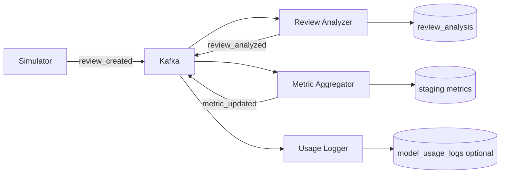

> **상태:** 구현 반영(REALIGNED) — 실제 스택: RDS MySQL · MSK(IAM) · MWAA · RunPod vLLM(Qwen2.5-7B) · Qdrant · AWS API Gateway. 본 문서의 PostgreSQL/Redis/Docker Compose/OpenAI·Claude 언급은 구현과 다름 — 스택 매핑·완성도는 [PROGRESS.md](../PROGRESS.md) 참조.

# Kafka 이벤트 파이프라인

| 항목 | 내용 |
|------|------|
| 문서 버전 | 1.0 |
| 작성일 | 2026-05-31 |
| 브로커 | Docker Compose 단일 브로커 (v1) |

---

## 1. 토픽 목록

| Topic | 파티션 (권장) | Retention | 설명 |
|-------|---------------|-----------|------|
| `review_created` | 3 | 7d | 신규·시뮬레이션 리뷰 생성 |
| `review_analyzed` | 3 | 7d | 감성·VOC 분석 완료 |
| `metric_updated` | 3 | 7d | 집계 스냅샷 갱신 알림 |

> **TODO (구현):** `KAFKA_AUTO_CREATE_TOPICS_ENABLE=false` + 명시적 topic create.

---

## 2. 메시지 스키마 (JSON)

모든 메시지 공통 봉투:

```json
{
  "event_id": "uuid",
  "event_type": "review_created",
  "occurred_at": "2026-05-31T12:00:00Z",
  "payload": { }
}
```

`event_id`는 멱등 처리 키로 사용.

---

### 2.1 `review_created`

**Producer:** Seed Simulator, Incremental Review Script, (선택) Gateway after manual review API **TODO**

**Consumer:** Review Analyzer (`consumer_group=review-analyzer-v1`)

```json
{
  "event_id": "7c9e6679-7425-40de-944b-e07fc1f90ae7",
  "event_type": "review_created",
  "occurred_at": "2026-05-31T12:00:00Z",
  "payload": {
    "review_id": "rp7eac94d1e77b9c7c4f8a80b65218a1",
    "order_id": "e481f90c4c5c6a1d8b1e2f3a4b5c6d7e",
    "review_score": 2,
    "review_comment_title": "Atraso na entrega",
    "review_comment_message": "Produto chegou com atraso...",
    "sim_review_date": "2026-05-31",
    "source": "simulator"
  }
}
```

| 필드 | 타입 | 필수 |
|------|------|------|
| `review_id` | string | Y |
| `order_id` | string | Y |
| `review_score` | int 1-5 | Y |
| `review_comment_title` | string | N |
| `review_comment_message` | string | N |
| `sim_review_date` | date string | Y |
| `source` | string | `simulator` / `seed` / `api` |

---

### 2.2 `review_analyzed`

**Producer:** Review Analyzer

**Consumer:** Metric Aggregator (`consumer_group=metric-aggregator-v1`)

```json
{
  "event_id": "a1b2c3d4-e5f6-7890-abcd-ef1234567890",
  "event_type": "review_analyzed",
  "occurred_at": "2026-05-31T12:00:02Z",
  "payload": {
    "review_id": "rp7eac94d1e77b9c7c4f8a80b65218a1",
    "order_id": "e481f90c4c5c6a1d8b1e2f3a4b5c6d7e",
    "product_id": "5cf42900-9b2b-4f3a-8c1d-2e3f4a5b6c7d",
    "sentiment": "negative",
    "voc_category": "delivery",
    "confidence": 0.91,
    "sim_review_date": "2026-05-31"
  }
}
```

DB 동기: `commerce_ops.review_analysis` UPSERT on `review_id`.

---

### 2.3 `metric_updated`

**Producer:** Metric Aggregator, (선택) Airflow `load_daily_metrics` **TODO**

**Consumer:** Usage Logger (`consumer_group=usage-logger-v1`) — 메트릭 이벤트 감사; 주 사용량은 Gateway 직접 기록.

```json
{
  "event_id": "b2c3d4e5-f6a7-8901-bcde-f12345678901",
  "event_type": "metric_updated",
  "occurred_at": "2026-05-31T12:00:05Z",
  "payload": {
    "metric_date": "2026-05-31",
    "category_name_en": "health_beauty",
    "gmv": 125000.50,
    "negative_review_count": 42,
    "aggregation_scope": "category_daily"
  }
}
```

---

## 3. Producer / Consumer 매핑



| 컴포넌트 | Role | Topics In | Topics Out |
|----------|------|-----------|------------|
| `review-simulator` | Producer | — | `review_created` |
| `review-analyzer` | Consumer/Producer | `review_created` | `review_analyzed` |
| `metric-aggregator` | Consumer/Producer | `review_analyzed` | `metric_updated` |
| `usage-logger` | Consumer | `metric_updated` | — |
| Gateway | — | — | — (v1: HTTP만) |

---

## 4. Consumer Groups

| Group ID | Service | Concurrency | Offset reset (dev) |
|----------|---------|-------------|-------------------|
| `review-analyzer-v1` | review-analyzer | 2 | earliest |
| `metric-aggregator-v1` | metric-aggregator | 2 | earliest |
| `usage-logger-v1` | usage-logger | 1 | latest |

**재처리:** `review_id` 기준 UPSERT로 at-least-once 허용.

> **TODO (구현):** Dead Letter Topic `review_created.dlq` — 3회 실패 시.

---

## 5. Replay 시나리오 (부하 테스트 · 시나리오 4)

### 5.1 목적

- Review Analyzer·DB 쓰기 처리량 측정
- k6가 HTTP와 별도로 이벤트 발행

### 5.2 절차

1. Consumer group offset 확인 (`review-analyzer-v1`)
2. Simulator 실행:

```bash
# TODO: 구현 후 실제 CLI
python scripts/kafka_replay_reviews.py \
  --topic review_created \
  --count 10000 \
  --rate 500 \
  --sim-today 2026-05-31
```

3. lag 모니터링: `kafka-consumer-groups --describe`
4. 완료 조건: `review_analysis` 건수 ≈ 발행 건수, lag=0

### 5.3 Idempotency

| 키 | 동작 |
|----|------|
| `review_id` | UPSERT `review_analysis` |
| `event_id` | 선택: `processed_events` 테이블 **TODO** |

### 5.4 Reset (개발만)

```bash
# TODO: 문서화만 — 프로덕션 금지
kafka-topics --delete --topic review_created
# 재생성 후 earliest consume
```

---

## 6. 환경 변수

```text
KAFKA_BOOTSTRAP_SERVERS=kafka:9092
KAFKA_REVIEW_CREATED_TOPIC=review_created
KAFKA_REVIEW_ANALYZED_TOPIC=review_analyzed
KAFKA_METRIC_UPDATED_TOPIC=metric_updated
```

---

## 7. 변경 이력

| 버전 | 날짜 | 변경 |
|------|------|------|
| 1.0 | 2026-05-31 | Kafka 설계 초안 |
