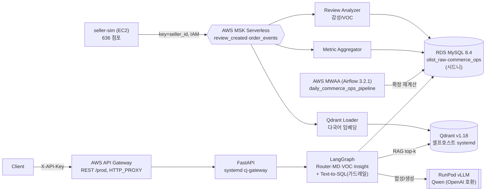

# AI Commerce Ops Platform — 세션 종합 (2026-05-31)

> **한 줄**: Olist 커머스 데이터 위에서 *자연어 질문 → LangGraph Agent → Text-to-SQL/RAG → 인사이트* 를
> AWS 관리형(MSK·RDS·MWAA·API Gateway) + 셀프호스트(Qdrant·vLLM) 풀스택으로 엔드투엔드 구동.

## 아키텍처 (검증된 실물)



## 컴포넌트 상태 (전부 동작 검증)

| 레이어 | 구성 | 상태 |
|---|---|---|
| 인제스천 | 시뮬레이터 → MSK → Review Analyzer / Metric Aggregator → RDS MySQL | ✅ |
| 데이터 | RDS MySQL(시드니, public) olist_raw 8테이블(reviews 98,410) + commerce_ops | ✅ |
| RAG 적재 | 리뷰 → fastembed(`paraphrase-multilingual-MiniLM-L12-v2`,384d) → Qdrant `reviews` | ✅ |
| 벡터DB | Qdrant v1.18 셀프호스트(edge-node-store EC2, systemd, API키) | ✅ |
| 배치 | **MWAA `daily_commerce_ops_pipeline`** → daily_category_metrics 확정 재계산(8,712행/606일) | ✅ |
| LLM | RunPod vLLM(Qwen, OpenAI 호환) | ✅ |
| Agent | LangGraph Router·MD/VOC/Insight + Text-to-SQL + RAG | ✅ |
| Gateway | FastAPI(systemd `cj-gateway`, :8000) ← **AWS API Gateway REST(/prod, HTTP_PROXY)** | ✅ |

## 검증된 데모 (그대로 재현 가능)

```bash
URL=https://lgvfh6v9ng.execute-api.ap-northeast-2.amazonaws.com/prod
# Text-to-SQL
curl -s -X POST "$URL/v1/sql/generate" -H "X-API-Key: oy_demo_md_key" \
  -H "Content-Type: application/json" -d '{"query":"카테고리별 GMV 상위 5개"}'
# MD Agent (route→SQL→RDS→vLLM 인사이트, ~7s)
curl -s -X POST "$URL/v1/agent/run" -H "X-API-Key: oy_demo_md_key" \
  -H "Content-Type: application/json" -d '{"agent_type":"md","query":"GMV 상위 카테고리와 인사이트"}'
```
결과 일관성: Agent의 `health_beauty $324,359.19` = MWAA 배치 재계산값과 동일 (스트림·배치·서빙이 한 데이터로 정합).

## 핵심 디버깅 교훈 (포트폴리오 가치)

1. **MWAA 3.2.1은 requirements.txt를 워커에 설치하지 않을 수 있음** → `startup_script.sh`로 `pip install` 강제(다른 메커니즘). 진단: 슬림 pymysql(순수 파이썬)도 누락 + AVAILABLE 6분 후에도 → requirements 경로 문제로 확정.
2. **크로스리전 RDS 접근**: MWAA(서울 vpc-0962)→RDS(시드니)는 **MWAA NAT EIP를 RDS 보안그룹 3306에 등록**해야 함(에러 2003).
3. **API Gateway**: `{proxy+}` URI는 `…/{proxy}`로(경로 보존), 배포는 **스테이지 생성 필수**(`create-deployment --stage-name prod`), 배포 직후 수초 전파 지연(Forbidden→200).

## 운영 메모

- **영속화**: Qdrant·FastAPI는 systemd(`qdrant`, `cj-gateway`) → 재부팅/세션 무관 상시.
- **시크릿**: `.env`(MYSQL_*/QDRANT_*/VLLM_*), MWAA Airflow Variable. 운영은 Secrets Manager 권장.
- **비용 주의(끄면 0)**: MSK·MWAA(~$195/mo)·RunPod·sim EC2 — 데모 아닐 때 중지/삭제.
- **튜닝 포인트**: vLLM(Qwen) 한국어 응답에 중국어 혼입 → Agent 프롬프트/모델 조정.

## 남은 작업(선택)

k6 부하테스트 · Fargate/EKS 배포 · API Gateway 사용량계획(throttle/usage) · semantic 캐시 · `GATEWAY_ORIGIN_SECRET`로 직접호출 차단.
