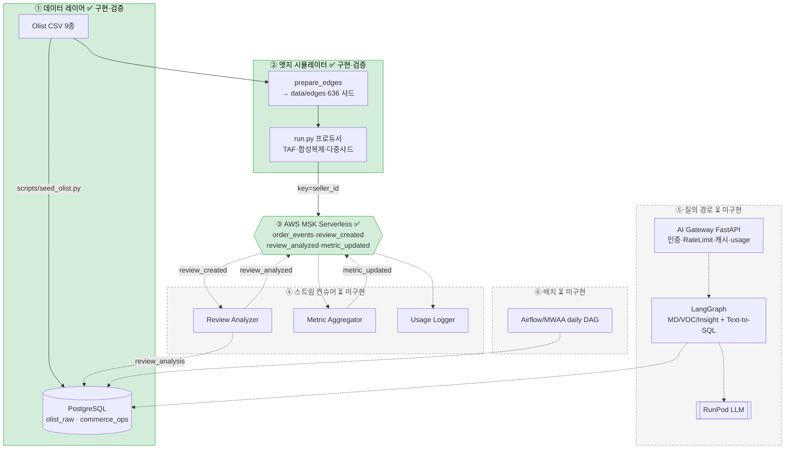

# Patch Log — 2026-05-31 · 엣지 점포 시뮬레이터 + MSK + 데이터 레이어

## 1. 세션 요약
- **Day1 데이터 레이어 구현·검증**: 2개 DB(`olist_raw`/`commerce_ops`) DDL + CSV 적재 + 부트스트랩. 로컬 PostgreSQL 16에 적재 검증(order_items 112,650 등, FK 무결성·읽기전용 롤·카테고리 GMV 집계 통과).
- **엣지 점포 시뮬레이터 구현·검증**: Olist를 **636개 지역 점포(state/city) 샤드**로 분할 → AWS **MSK Serverless**로 "실시간처럼" 발행. 실제 클러스터(`cj-cluster-edge`, ap-northeast-2)에 **5,438건 발행(err 0) → 5,459건 소비** 확인.
- **코드 재구성**: `src/edge_simulator/`(모듈) ↔ `scripts/`(CLI 엔트리) 분리. `run.py`를 scripts로 이동.
- **loguru 로깅**: `/workspace/app_logs/{app_name}/` 파일 + 콘솔.
- **유닛테스트**: `tests/edge_simulator/` 16개 통과.
- **문서화**: `docs/setup/`(Kaggle→AWS 구성요소별 가이드), README 시뮬레이터/리셋/재현 섹션.

## 2. 아키텍처 구현 현황 (도식)


## 3. 컴포넌트별 상태
| # | 컴포넌트 | 상태 | 핵심 산출물 |
|---|----------|------|-------------|
| ① | 데이터 레이어 | ✅ 구현·검증 | `db/schema/**`, `scripts/seed_olist.py`, `scripts/setup_db.sh` |
| ② | 엣지 시뮬레이터 | ✅ 구현·검증 | `src/edge_simulator/**`, `scripts/{prepare_edges,run}.py` |
| ③ | MSK Serverless | ✅ 토픽 4종 생성·발행/소비 검증 | `scripts/kafka_admin.py`, `src/edge_simulator/admin.py` |
| ④ | 스트림 컨슈머 | ⏳ 미구현 | (예정) Review Analyzer→`review_analysis` |
| ⑤ | Gateway·Agents·RunPod | ⏳ 미구현 | (예정) FastAPI + LangGraph + Text-to-SQL |
| ⑥ | Airflow(MWAA) 배치 | ⏳ 미구현 | (예정) `daily_commerce_ops_pipeline` |
| — | 배포(Fargate/EKS)·k6 | ⏳ 미구현 | (예정) |

## 4. 이번 세션 변경 파일
**추가**
```
src/edge_simulator/{__init__,logging_setup,config,kafka_auth,prepare,shards,producer,admin,verify}.py
scripts/{run,prepare_edges,kafka_admin,consume_check}.py   # 엔트리(얇음)
db/schema/olist_raw/001_tables.sql, db/schema/commerce_ops/001_tables.sql
db/init/{00_create_databases,01_roles}.sql, db/seed/commerce_ops/20_bootstrap.sql
scripts/{seed_olist.py,setup_db.sh}
tests/edge_simulator/{conftest,test_prepare,test_producer,test_shards,test_config}.py
docs/setup/{README,01_data_kaggle,02_python_env,03_database,04_msk,05_edge_simulator}.md
pyproject.toml, patch_logs/2026-05-31_edge-simulator-msk.md
```
**수정**: `README.md`(시뮬레이터/리셋/재현 섹션), `requirements.txt`(loguru/pytest/psycopg2), `.gitignore`(data/edges/)
**제거**: `src/run.py`(→ scripts/run.py + src 모듈로 분해), `scripts/produce_shards.py`(→ src/edge_simulator/producer.py)

## 5. 검증 기록
| 항목 | 결과 |
|------|------|
| DB 적재 | order_items 112,650 / customers 99,441 / reviews 98,410(dedup) / FK 무결성 OK |
| state/city 노드 수 | 636 (DB·시뮬레이터 일치) |
| MSK 연결·IAM | OK (토픽 4종 확인) |
| MSK 발행→소비 | 5,438 발행(err 0) → 5,459 소비 |
| 유닛테스트 | 16 passed |
| loguru | `/workspace/app_logs/edge_simulator/edge_simulator_2026-05-31.log` 생성 |

## 6. 분할 데이터 위치
- **`data/edges/`** — 노드당 1개 JSONL 샤드(636개) + `manifest.json`. 약 113MB, `.gitignore` 처리(생성물).
- 재생성: `python scripts/prepare_edges.py`

## 7. 다음 단계
1. **Review Analyzer 컨슈머** (`review_created`→RunPod 감성/VOC→`review_analysis`) — 완성 시 컨슈머 랙·오토스케일·DB 백프레셔 등 대용량 *운영* 실험 가능
2. AI Gateway(FastAPI) + LangGraph Agents + Text-to-SQL
3. Airflow(MWAA) 일별 DAG
4. 배포(Fargate 주력 + EKS manifest) + k6 부하테스트
